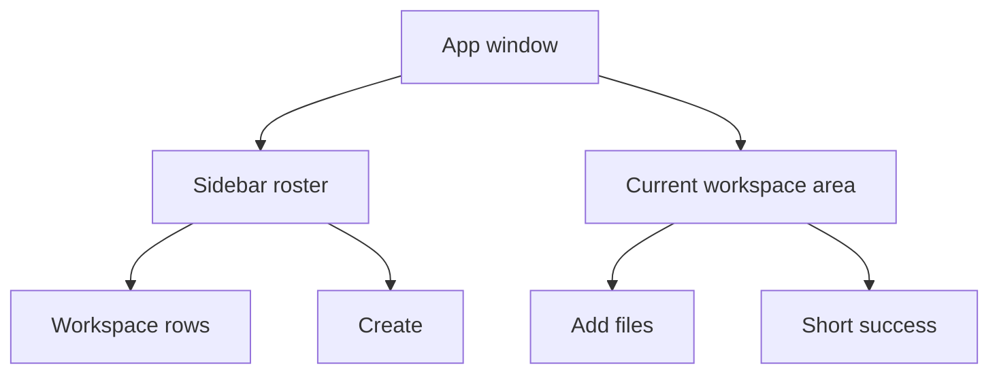
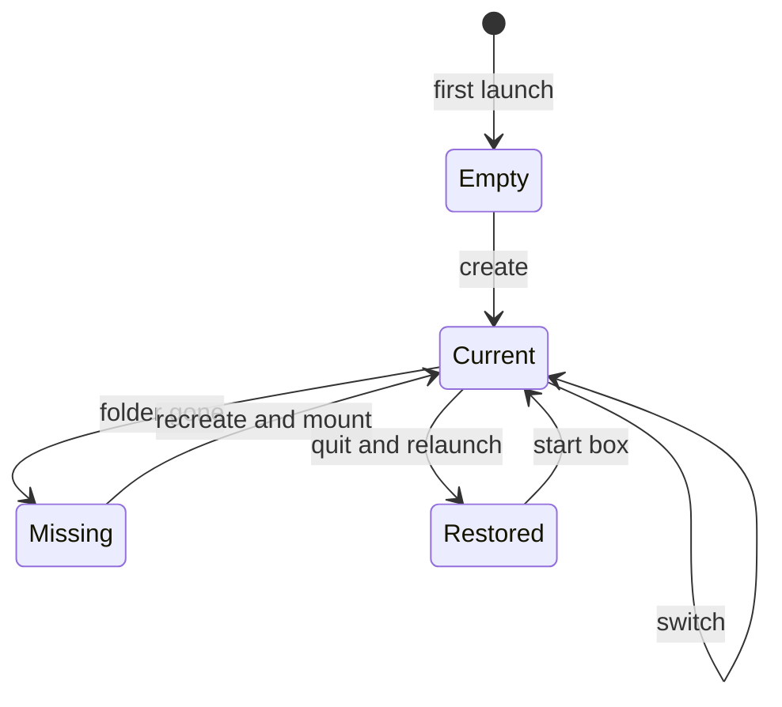
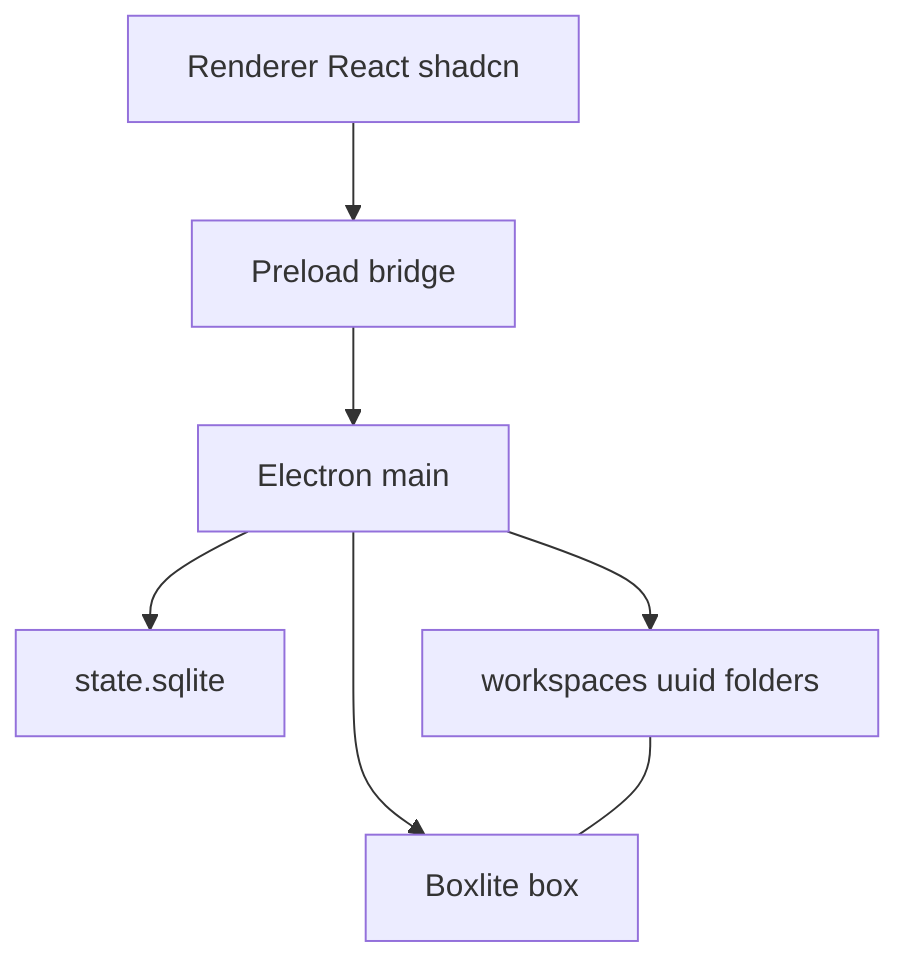
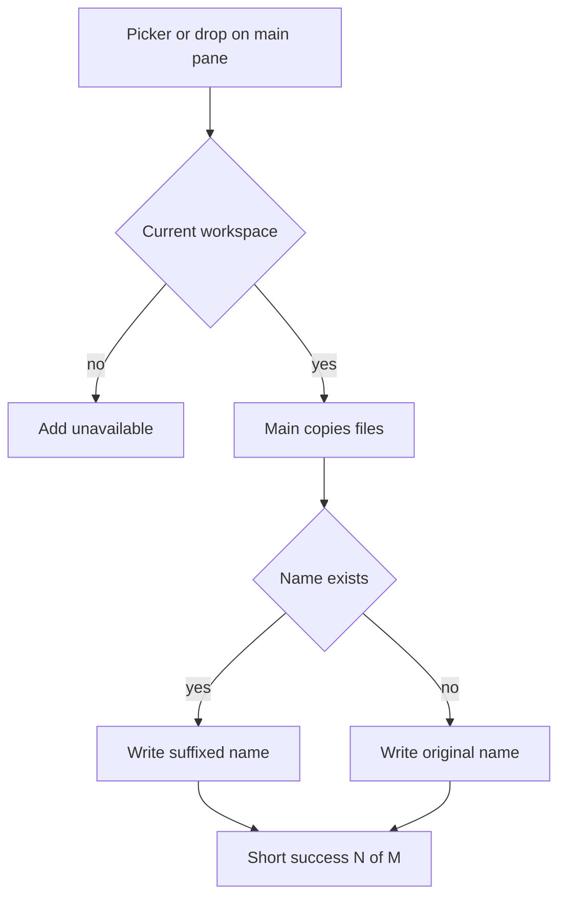

# Cohort Desktop Workspace Loop - Plan

This file is archived history. It is not a run queue. Live requirements are in `ROADMAP.md`.

## Goal Capsule

- **Objective:** Ship a local desktop app for the first workspace loop: a roster you can create and switch, files you can add to the current workspace, and a Boxlite box that mounts that workspace while it is current. Captain chat, specialists, and custom tools are not active scope.
- **Product authority:** `AGENTS.md` and `ROADMAP.md` v1. The owner is the only user. Do not invent a first mission. Product Contract R/A/F/AE IDs below win on behavior.
- **Execution profile:** Smoke-first for the window shell. Test-first for roster, paths, copy, and box lifecycle.
- **Stop conditions:** If Boxlite cannot mount a host folder as `/workspace` on the owner's Mac after the U5 spike, stop and report a blocker. Do not drop the box to ship files-only.
- **Tail ownership:** The implementer owns native-module rebuild and a local `dev` smoke. This plan does not require a packaged installer or a PR.
- **Open blockers:** None. Remaining items are deferred implementation notes.

---

## Product Contract

### Summary

A local Electron app where the owner keeps a roster of workspaces, creates and switches among them in a sidebar, and adds files into the current one. While a workspace is current, a Boxlite box runs with that workspace folder mounted as `/workspace`. The first build introduces an electron-vite React shell, a main-process SQLite roster, and a box bound to the current workspace.

### Problem Frame

The repo is a product brief with no app. The owner has no existing folder habit or workaround for keeping files with a workspace. `ROADMAP.md` starts with create and reopen a local workspace; talk to the captain is the next item. Local sandbox is assumed in `AGENTS.md`, not a later extra. Without a desktop home that makes workspaces real, later captain work has nowhere to pin files or a box.

### Key Decisions

- **First workspace loop, not a captain slice.** Prove create, reopen, add files, and a live box before embedding the agent runtime (now Prime Agent). (session-settled: user-approved — chosen over empty shell, captain loop, or sandbox-only: prove create/reopen before agents) Governs R1, R4, R11, R15.
- **Files only.** Chat storage and any chat UI wait for the captain. (session-settled: user-directed — chosen over keep empty chat with the workspace: chat waits for the captain) Governs R11.
- **Add files from the app.** The loop is not a file manager and not folder-only. (session-settled: user-directed — chosen over see a file list or no file UI: drop or import into the current workspace) Governs R11, R12, R13.
- **Sidebar roster with switch and create.** Several workspaces can exist; only one is current. (session-settled: user-approved — chosen over list-only or implicit current: click to switch, create from the sidebar) Governs R3, R4, R7, R8.
- **Box runs while a workspace is current.** Switching remounts. No current workspace means no box. (session-settled: user-approved — chosen over start-after-add, prove-once, or host-files-only) Governs R15, R16, R17.
- **UUID is the folder name.** Optional display name; empty name uses the UUID. (session-settled: user-directed — chosen over a separate id plus typed name, or auto-name only: UUID is the directory name) Governs R5, R6.
- **SQLite is the roster.** It stores uuid, display name, and which workspace is current. (session-settled: user-directed — chosen over scanning folders alone: name and current cannot be inferred from disk) Governs R2, R7, R10, R19.
- **Missing folder is recreated on open.** SQLite stays the source of truth. (session-settled: user-approved — chosen over fail-the-open, drop-the-row, or repair-from-disk) Governs R10, R18.
- **shadcn on Base UI.** One stack: shadcn styled components on `@base-ui/react` primitives, the July 2026 shadcn default. Not Uber `baseui`. (session-settled: user-directed — chosen over Base-UI-only or two competing kits: Base UI is shadcn's default primitive layer) Governs R1.
- **Short success after add.** No file names, no browser, no editor. (session-settled: user-directed — chosen over listing new names or revealing the folder) Governs R13.
- **Desktop shell is Electron.** Opening directive for this bootstrap. Unlabeled: not examined against another desktop shell.

### How This Work Fits Together

This plan owns the first workspace loop on the desktop. The broader breakdown below is the current understanding, not a committed roadmap.

- Captain conversation
  - Depends on this plan's current workspace and running box
  - Enables specialists and workspace-local tools
- Specialists and workspace-local tools
  - Depends on captain conversation
- Shared knowledge base, remote workspaces, other users
  - Outside v1 identity per `AGENTS.md`
  - Still to decide as later product work; not implied by this plan

This slice absorbs "create more workspaces when needed" for the local roster. An empty desktop shell is not a separate plan.

### Actors

- A1. Owner — the only user. Creates and switches workspaces and adds files.
- A2. Workspace box — the Boxlite environment for the current workspace. Mounts the current folder as `/workspace`. Invisible when no workspace is current.

### Requirements

**Desktop shell**

- R1. The product is a local Electron desktop window built with React and shadcn on Base UI primitives (`@base-ui/react`), not Uber `baseui`.

**Workspace roster**

- R2. A SQLite store is the source of truth for each workspace UUID, display name, and which workspace is current.
- R3. A sidebar lists every workspace in that store.
- R4. The owner can create a new workspace from the sidebar.
- R5. Create assigns a UUID and uses it as the directory name under `~/.cohort/workspaces/<uuid>`.
- R6. Create accepts an optional display name. If the name is empty, the display name is the UUID.
- R7. Clicking a sidebar row makes that workspace current and writes current to SQLite.
- R8. At most one workspace is current.
- R9. First launch with an empty roster has no current workspace.
- R10. Folders under `~/.cohort/workspaces` that have no SQLite row stay out of the sidebar.

**Files**

- R11. The owner can add files into the current workspace from the app.
- R12. Added files land in that workspace's folder on disk.
- R13. After a successful add, the app shows a short success only. It does not list file names, open a file browser, or open an editor.
- R14. Add files is unavailable when no workspace is current.

**Sandbox and reopen**

- R15. While a workspace is current, a Boxlite box runs with `~/.cohort/workspaces/<uuid>` mounted as `/workspace`.
- R16. Switching current remounts the newly current folder as `workspace`.
- R17. When no workspace is current, no box runs.
- R18. Opening a workspace whose folder is missing creates an empty `~/.cohort/workspaces/<uuid>` again, then applies R15. Name and current stay as stored.
- R19. Quit and relaunch restores the SQLite roster and the last current workspace, then applies R15 if a current workspace exists.



### Key Flows

- F1. First create
  - **Trigger:** Owner launches the app with an empty roster.
  - **Actors:** A1, A2
  - **Steps:** Sidebar is empty. Add files is unavailable. No box runs. Owner creates a workspace with an optional name. App commits insert plus current in one SQLite transaction, ensures the folder, and enqueues box start. The main pane shows box status `starting`, then `running` or `error`.
  - **Covered by:** R3, R4, R5, R6, R7, R9, R14, R15, R17
- F2. Switch workspace
  - **Trigger:** Owner clicks another sidebar row.
  - **Actors:** A1, A2
  - **Steps:** App writes the new current workspace. Previous box mount is replaced. New folder is mounted as `/workspace`. Later adds go to the new current folder.
  - **Covered by:** R7, R8, R12, R16
- F3. Add files
  - **Trigger:** Owner adds files while a workspace is current.
  - **Actors:** A1
  - **Steps:** Files land in the current workspace folder. App shows a short success. App does not show a file list.
  - **Covered by:** R11, R12, R13
- F4. Reopen
  - **Trigger:** Owner quits and launches again after at least one workspace exists.
  - **Actors:** A1, A2
  - **Steps:** Sidebar shows the stored roster. Last current workspace is current. Box starts and mounts that folder as `workspace`.
  - **Covered by:** R3, R19, R15
- F5. Missing folder
  - **Trigger:** Owner opens or switches to a stored workspace whose directory is gone.
  - **Actors:** A1, A2
  - **Steps:** App recreates the empty directory. Name and current stay as stored. Box mounts the new empty folder as `workspace`.
  - **Covered by:** R18, R2



### Acceptance Examples

- AE1. Empty first launch
  - **Covers R9, R14, R17.**
  - **Given:** No rows in SQLite.
  - **When:** The owner launches the app.
  - **Then:** The sidebar is empty, add files is unavailable, and no box runs.
- AE2. Empty display name
  - **Covers R5, R6.**
  - **Given:** The owner creates a workspace and leaves the name blank.
  - **When:** Create completes.
  - **Then:** The folder is `~/.cohort/workspaces/<uuid>` and the sidebar label is that UUID.
- AE3. Named workspace
  - **Covers R5, R6.**
  - **Given:** The owner creates a workspace named "Notes".
  - **When:** Create completes.
  - **Then:** The folder is still the UUID path and the sidebar shows "Notes".
- AE4. Add before create
  - **Covers R14.**
  - **Given:** No workspace is current.
  - **When:** The owner looks for add files.
  - **Then:** Add files is unavailable.
- AE5. Add goes to current
  - **Covers R11, R12, R13.**
  - **Given:** Workspace A is current.
  - **When:** The owner adds a file and then switches to workspace B.
  - **Then:** The file is in A's folder, not B's, and the app showed only a short success.
- AE6. Unknown folder stays hidden
  - **Covers R10.**
  - **Given:** A directory exists under `~/.cohort/workspaces` with no SQLite row.
  - **When:** The owner launches the app.
  - **Then:** That directory does not appear in the sidebar.
- AE7. Missing folder on switch
  - **Covers R18.**
  - **Given:** A stored workspace has no directory.
  - **When:** The owner switches to it.
  - **Then:** The empty directory is created, the stored name remains, and the box mounts that folder as `workspace`.
- AE8. Restore current
  - **Covers R19, R15, R18.**
  - **Given:** Workspace B was current when the app last quit. B's folder may be missing.
  - **When:** The owner launches again.
  - **Then:** B is current. If the folder was missing it is recreated empty. The box then mounts that folder as `workspace`, or the KTD6 error path applies.
- AE9. Create selects the new workspace
  - **Covers R4, R7, R16.**
  - **Given:** Workspace A is current.
  - **When:** The owner creates workspace B.
  - **Then:** B is current and the box remounts B's folder.
- AE10. Box start failure
  - **Covers R7, R11, R15.**
  - **Given:** The owner selects a workspace and the box fails to start.
  - **When:** The owner adds a file.
  - **Then:** The workspace stays current, the main pane shows a box error, and the file still lands in the folder.
- AE11. Name collision
  - **Covers R12, R13.**
  - **Given:** `report.txt` already exists in the current workspace folder.
  - **When:** The owner adds another `report.txt`.
  - **Then:** The new file is stored under a suffixed name and the app shows a short success.
- AE12. Folders rejected
  - **Covers R11.**
  - **Given:** A workspace is current.
  - **When:** The owner drops or picks a folder.
  - **Then:** The folder is not copied and the app shows a short error.

### Scope Boundaries

**Deferred for later**

- Captain conversation, chat history, and any chat UI
- Specialists, custom tools, and Prime Agent runtime
- In-app file browser, file editor, and rename after create
- Delete workspace
- Repair the roster from disk
- Uber `baseui` as a second visual kit

**Outside this product's identity**

- Other users, accounts, or sharing
- Remote or cloud workspaces
- Shared knowledge base
- Inventing a first named mission

**Deferred to Follow-Up Work**

- Packaged installer and code-signed release
- Windows and Intel Mac as first-class Boxlite targets
- Workspace delete and rename

### Dependencies / Assumptions

- Boxlite can run a local box on the owner's machine and mount a host folder as `workspace`.
- The owner can write `~/.cohort/workspaces`.
- New shadcn projects default to Base UI primitives as of July 2026. Planning uses that default, not Radix, unless a blocker appears.
- What the owner does with files after they land is outside this app in this slice.

### Outstanding Questions

**Resolve Before Planning**

None.

**Deferred to implementation**

- Exact Boxlite image tag and CPU/memory defaults after the U5 spike.
- Native-module rebuild flags for the chosen Electron major.
- Sidebar sort is create-time ascending unless a later unit finds a cheaper default.

### Sources / Research

- `AGENTS.md` — owner-only v1, Prime Agent later, sandbox assumed, do not invent a mission.
- `ROADMAP.md` — create and reopen a local workspace is the first unchecked v1 item; talk to the captain is later.
- [July 2026 — Base UI as the Default](https://ui.shadcn.com/docs/changelog/2026-07-base-ui-default) — new shadcn projects use Base UI primitives; Radix remains supported.
- [electron-vite guide](https://electron-vite.org/guide) — main, preload, renderer split.
- [Electron security](https://www.electronjs.org/docs/latest/tutorial/security) — `contextIsolation`, no `nodeIntegration`, preload `contextBridge`.
- [Boxlite Node volume mounts](https://docs.boxlite.ai/tutorials/file-transfer) — `hostPath` / `guestPath` / `stop()`.
- [better-sqlite3 Electron notes](https://github.com/wiselibs/better-sqlite3/blob/master/docs/troubleshooting.md) — rebuild native addon for Electron.

---

## Planning Contract

Product Contract preservation: restructured, no scope change: added AE9–AE12 for deferred-to-planning resolutions; R1–R19 unchanged.

### Key Technical Decisions

- KTD1. **electron-vite + React + TypeScript + shadcn Base UI, installed with pnpm.** Scaffold a new desktop app with the official Vite React template path and `pnpm dlx shadcn@latest init` on the default Base UI primitive. (session-settled: user-directed — chosen over npm: use pnpm) Cites R1.
- KTD2. **Secure renderer and closed bridge.** `contextIsolation: true`, `nodeIntegration: false`, `sandbox: true`. Preload exports a fixed allowlist only. The renderer never sends host destination paths. Drop source paths come only through the preload file-path helper. Cites R1.
- KTD3. **Roster in main-process better-sqlite3.** Database file is `~/.cohort/state.sqlite`. One current pointer is enforced in the same transaction as create or switch. Native addons share one Electron ABI rebuild. SQLite open failure is hard-fail. Cites R2.
- KTD4. **Create always selects.** Preflight the new UUID path first. Refuse a non-empty orphan or symlink escape before any write. Then one SQLite commit inserts the row and sets current. Folder ensure and box remount are after-commit side effects. (session-settled: user-approved — chosen over leave-previous-current: create means use it now) Cites R4, R7, R16.
- KTD5. **Picker and drop, files only, no overwrite.** Drop lands only on the current-workspace main pane. Copy only regular files. Destination name is a single path segment. Name clashes get a suffix. A batch pins the uuid at start and reports N of M. (session-settled: user-approved — chosen over picker-only or silent overwrite: files only, no clobber) Cites R11, R12, R13, R14.
- KTD6. **Boxlite stop then create on current change.** Guest path is `/workspace`, read-write. Roster commit is not one transaction with the box. `setCurrent` returns after SQLite with box status `starting`; remount runs on a single-flight queue; later status is pushed on `onBoxStatus`. Start failure keeps current, shows an error, and still allows add files. Host folder is the file source of truth; the box is only an execution mount. (session-settled: user-approved — chosen over block-the-app or revert-current: files loop stays usable) Cites R15, R16, R17, R18, R19.
- KTD7. **Single-instance lock plus in-process current queue.** A second launch focuses the first window. Create, switch, restore, and quit share one remount queue so mount uuid matches SQLite current.
- KTD8. **macOS first.** Boxlite is required on Apple Silicon macOS. Other platforms may show the box error from KTD6. Do not drop the box from the Mac happy path. Empty-box cost while current is accepted. (session-settled: user-approved — chosen over block-launch or files-only-everywhere: Mac first, box best-effort elsewhere)
- KTD9. **Main derives every workspace path.** Renderer may send a UUID only. Main joins `~/.cohort/workspaces/<uuid>` after a UUID format and roster-membership check. Resolved path must stay under the workspaces root. A symlink-escaped workspace directory is a box error, not a mount.

### High-Level Technical Design

Renderer never touches disk, SQLite, or Boxlite. Main owns those three and publishes roster plus box status over IPC.

Roster current and box mount are two truths. SQLite commits first. Box status is `none`, `starting`, `running`, or `error`. Host directory is the file source of truth. The box must not gate host copy.



Switch replaces the box. SQLite current updates first. Then main stops the old box and creates a new one with the new host folder.

```mermaid
sequenceDiagram
  participant Owner
  participant UI
  participant Main
  participant Db
  participant Box
  Owner->>UI: click other row
  UI->>Main: setCurrent uuid
  Main->>Db: write current
  Main-->>UI: current plus box starting
  Main->>Box: queued stop previous
  Main->>Box: create hostPath guest /workspace
  Main-->>UI: box running or error
```

Add files copy in main. The renderer only starts a picker or drop and shows the short result.



### Output Structure

```text
package.json
electron.vite.config.ts
components.json
src/main/index.ts
src/main/db.ts
src/main/workspaces.ts
src/main/files.ts
src/main/box.ts
src/main/ipc.ts
src/preload/index.ts
src/renderer/src/App.tsx
src/renderer/src/components/workspace-sidebar.tsx
src/renderer/src/components/workspace-main.tsx
src/renderer/src/components/ui/
src/main/db.test.ts
src/main/workspaces.test.ts
src/main/files.test.ts
src/main/box.test.ts
```

The tree is a scope declaration. Per-unit `Files` lists stay authoritative.

### Sequencing

U1 shell, then U2 store, then U3 roster UI, then U4 add files, then U5 box. U5 starts with a Boxlite mount spike. Path confinement from KTD9 lands in U2 and is reused by U4 and U5. Ensure-folder runs on every current-establishing path in U2 and U3, not only when U5 starts a box.

### System-Wide Impact

- **IPC trust boundary:** Renderer is untrusted. Main validates UUID, derives paths, and copies. A later captain UI must keep this closed bridge.
- **Failure propagation:** SQLite failure blocks the app. Box failure does not. Folder ensure failure keeps the committed current, sets folder status `error`, and surfaces a short error. Add files then refuse that batch if the pinned directory is missing or not writable.
- **Native ABI:** `better-sqlite3` and Boxlite share one Electron rebuild. Sqlite load failure is fatal. Boxlite load failure follows KTD6.
- **Quit and orphan boxes:** App quit stops the box. Next launch reaps leftovers before restore.
- **Later agents:** Host folder remains the workspace tree they will see. This slice does not start Prime Agent.

### Risks

- Boxlite native runtime and Electron ABI may fail on the owner's machine. U5 spikes first. Stop if mount as `/workspace` cannot work.
- `better-sqlite3` needs electron-rebuild. Fail U2 if the addon does not load in Electron.
- Rapid switch can cross stop/create. Mitigate with KTD7's remount queue. If `stop()` fails, do not start a second box. Surface error.
- Workspace directory replaced by a symlink can widen the mount. Mitigate with KTD9. Do not mount.
- Default box network may allow exfil of `/workspace`. Spike records network posture. Prefer no outbound net if Boxlite allows it.
- shadcn Vite + electron-vite alias setup is easy to miswire. U1 proves one shadcn control in the window before later UI.
- Always-on empty box uses CPU. Accepted under the settled box-while-current rule. Stop on quit.

---

## Implementation Units

### U1. Desktop shell

- **Goal:** A secure Electron window runs a React renderer with shadcn on Base UI.
- **Requirements:** R1
- **Dependencies:** none
- **Files:** `package.json`, `electron.vite.config.ts`, `components.json`, `src/main/index.ts`, `src/preload/index.ts`, `src/renderer/src/App.tsx`, `src/renderer/src/components/ui/`
- **Approach:**
  1. Scaffold electron-vite React TypeScript per KTD1.
  2. Init shadcn with the Base UI default. Do not add Uber `baseui`.
  3. Apply KTD2 window preferences and a minimal preload bridge.
  4. Apply KTD7 single-instance lock.
  5. Add `pnpm run typecheck` to the scaffold.
- **Execution note:** Prefer install and `dev` smoke over unit coverage. Prove the window paints a shadcn control.
- **Patterns to follow:** electron-vite main/preload/renderer split. Electron default_app secure window flags.
- **Test scenarios:**
  - Happy path: `dev` opens one window and shows a shadcn button or equivalent.
  - Edge: a second launch focuses the first window.
  - Error: renderer has no `require` / Node globals.
- **Verification:** Window opens. Preload bridge is the only renderer-to-main path. No Uber `baseui` dependency.

### U2. Roster store and folders

- **Goal:** Main can create, list, and select workspaces in SQLite and on disk.
- **Requirements:** R2, R5, R6, R8, R9, R10, R18
- **Dependencies:** U1
- **Files:** `package.json`, `src/main/db.ts`, `src/main/workspaces.ts`, `src/main/db.test.ts`, `src/main/workspaces.test.ts`
- **Approach:**
  1. Open `~/.cohort/state.sqlite` per KTD3. Create `~/.cohort` if missing.
  2. Persist uuid, name, and one current pointer.
  3. Preflight the new UUID path. Then commit insert plus current. Then ensure the directory.
  4. Empty or whitespace name stores the UUID as the display name per R6.
  5. Selecting a missing directory recreates it empty per R18. Do not scan disk for extra folders per R10.
  6. Apply KTD9: UUID format check and path confinement. Create refuses a non-empty pre-existing orphan path. A symlink-escaped workspace directory is not mounted; treat it as a box error per KTD9, not a refused select.
  7. Tests use an injectable root, not the owner's `~/.cohort`. Land `pnpm test` for main-process unit tests in this unit.
- **Execution note:** Implement domain behavior test-first.
- **Patterns to follow:** KTD3. Product Key Decision "SQLite is the roster".
- **Test scenarios:**
  - Happy path: create with name "Notes" stores UUID folder and display name "Notes". Covers AE3.
  - Happy path: create with blank name stores and returns the UUID as the name. Covers AE2.
  - Edge: whitespace-only name is treated as empty.
  - Edge: two workspaces may share the same display name.
  - Edge: at most one current pointer after two creates. Covers AE9 store side.
  - Edge: list ignores a UUID directory that has no row. Covers AE6.
  - Error: open of a missing registered folder recreates the empty directory and keeps the row. Covers AE7 store side.
  - Error: refuse to open the database if `~/.cohort` cannot be created or `state.sqlite` is not a readable SQLite file; return a typed error.
  - Error: `..` or a non-UUID id is rejected before any filesystem join.
  - Error: create does not adopt a non-empty pre-existing directory at the new UUID path.
- **Verification:** Tests cover AE2, AE3, AE6, AE7 store behavior. No renderer import of `better-sqlite3`.

### U3. Sidebar create, switch, restore

- **Goal:** The owner can create and switch workspaces in the sidebar and reopen the last current one.
- **Requirements:** R3, R4, R7, R8, R9, R14, R18, R19
- **Dependencies:** U1, U2
- **Files:** `src/main/ipc.ts`, `src/preload/index.ts`, `src/renderer/src/App.tsx`, `src/renderer/src/components/workspace-sidebar.tsx`, `src/renderer/src/components/workspace-main.tsx`
- **Approach:**
  1. Expose list, create, and setCurrent on the preload bridge.
  2. Sidebar lists every SQLite row and marks the current one.
  3. Create uses KTD4: the new row becomes current.
  4. Empty roster shows no current workspace and disables add files per R9 and R14.
  5. Launch reads SQLite and restores current per R19. If current exists, run the same ensure-folder helper as switch before U4 can copy. Box start waits for U5.
  6. Main pane shows the current display name and the add-files control when current exists.
  7. Preload allowlist is list, create, setCurrent, and later add/box status only. No raw invoke.
- **Patterns to follow:** KTD2 IPC. KTD4. Flows F1, F2, F4.
- **Test scenarios:**
  - Happy path: empty launch shows an empty sidebar and no add-files control. Covers AE1.
  - Happy path: create from empty selects the new workspace and enables add files. Covers F1.
  - Happy path: create while A is current selects B. Covers AE9.
  - Happy path: click A then B updates current and the main-pane name.
  - Happy path: quit and relaunch restores last current in the sidebar. Covers AE8 roster side.
  - Edge: drop or add control is unavailable with no current. Covers AE4.
- **Verification:** F1, F2, F4 roster behavior works without a live box. Current is visible in the sidebar.

### U4. Add files

- **Goal:** The owner can add files into the current workspace folder from picker or drop.
- **Requirements:** R11, R12, R13, R14
- **Dependencies:** U3
- **Files:** `src/main/files.ts`, `src/main/files.test.ts`, `src/main/ipc.ts`, `src/preload/index.ts`, `src/renderer/src/components/workspace-main.tsx`
- **Approach:**
  1. Native open-file dialog for picker. Drop target is the current-workspace main pane only per KTD5.
  2. Main copies into the current folder. Renderer never writes disk.
  3. Reject directories and non-regular files with a short error. Covers AE12.
  4. Destination name is the final path segment only. On name clash, write a suffixed name. Covers AE11.
  5. Multi-file add pins the uuid at start, copies what it can, and returns N of M. Show short success per R13. Do not list names.
  6. Do not follow a destination symlink. Do not write outside the pinned uuid directory.
- **Execution note:** Implement copy rules test-first. Dialog smoke can stay manual.
- **Patterns to follow:** KTD5. Electron `dialog:openFile` IPC pattern.
- **Test scenarios:**
  - Happy path: copy `a.txt` into the current UUID folder. Covers AE5 copy side.
  - Happy path: two files copy and result is 2 of 2.
  - Edge: existing `a.txt` writes `a (1).txt`. Covers AE11.
  - Edge: folder input is rejected and nothing is created. Covers AE12.
  - Edge: one missing source in a batch still copies the rest and reports N of M.
  - Error: no current workspace refuses the copy. Covers AE4.
  - Integration: after switch, a copy lands in the new current folder, not the old one. Covers AE5.
  - Integration: switch during a batch does not split files across folders.
  - Error: a basename with separators is rejected.
- **Verification:** Tests cover AE4, AE5, AE11, AE12. UI shows only a short success or short error.

### U5. Boxlite bound to current

- **Goal:** A Boxlite box runs with the current folder mounted as `/workspace`, or the owner sees an error and can still add files.
- **Requirements:** R15, R16, R17, R18, R19
- **Dependencies:** U3, U4
- **Files:** `src/main/box.ts`, `src/main/box.test.ts`, `src/main/index.ts`, `src/main/ipc.ts`, `src/preload/index.ts`, `src/renderer/src/components/workspace-main.tsx`
- **Approach:**
  1. Spike first: create a box with `hostPath` = workspace folder and `guestPath` = `/workspace` using `@boxlite-ai/boxlite`. Record default network posture. Stop if mount cannot work on the owner's Mac.
  2. On current set, enqueue stop-then-create per KTD6 and KTD7. Publish `starting` then `running` or `error`.
  3. No current means no box per R17.
  4. Missing folder is created before start per R18. Do not mount a symlink-escaped directory per KTD9.
  5. Start failure keeps current, sets box error status, and leaves U4 available. Covers AE10. If stop fails, do not start a second box.
  6. Launch lists Boxlite boxes owned by this app, stops leftovers, then starts the restored current. If list/stop fails, publish box error and continue so files still work. Record the list/stop API in the spike. Covers AE8 box side.
  7. Quit stops the box.
  8. After `setCurrent` returns `starting`, main pushes later status on a preload `onBoxStatus` event. Do not poll.
- **Execution note:** Spike mount before wiring IPC. Prefer a fake box port in unit tests; one live smoke on Mac.
- **Patterns to follow:** KTD6, KTD8. Boxlite Node `SimpleBox` / `runtime.create` + `stop()`.
- **Test scenarios:**
  - Happy path: set current starts a box whose guest mount is `/workspace` on that host folder. Covers AE8 box side / R15.
  - Happy path: switch stops the previous box and starts one for the new folder. Covers R16.
  - Happy path: clear/empty current starts no box. Covers R17 / AE1 box side.
  - Edge: missing folder is created, then the box starts on the new empty directory. Covers AE7.
  - Error: start throw leaves current set, publishes error status, and copy still succeeds. Covers AE10.
  - Integration: create from U3 triggers the remount path. Covers AE9.
  - Integration: overlapping switches end with mount uuid equal to SQLite current.
  - Error: a symlink workspace directory does not mount and publishes box error.
- **Verification:** AE7, AE8, AE9, AE10 hold on Mac. Files still add when the box is down. No box process remains after quit.

---

## Verification Contract

| Gate           | Command                 | When                           | Proves                                   |
| -------------- | ----------------------- | ------------------------------ | ---------------------------------------- |
| Typecheck      | `pnpm run typecheck`    | After each unit                | TS project compiles                      |
| Unit tests     | `pnpm test`             | After U2–U5                    | Roster, paths, copy, box port            |
| Dev smoke      | `pnpm run dev`          | After U1, then after U3 and U5 | Window, create/switch, add, box or error |
| AE walkthrough | Manual against AE1–AE12 | Before done                    | Product contract                         |

There is no existing CI. Do not invent a release pipeline in this plan.

---

## Definition of Done

- R1–R19 and AE1–AE12 are satisfied on the owner's Mac, or U5 has stopped on a documented Boxlite blocker.
- Every feature-bearing unit's test scenarios exist and pass, except U1 smoke-only cases.
- Abandoned spike code is removed from the diff.
- No captain, chat, file browser, or Uber `baseui` landed.
- Product Contract IDs were not rewritten except the planned AE9–AE12 additions.

**Per unit**

- U1. Window opens with shadcn on Base UI and a sandboxed renderer.
- U2. SQLite roster and UUID folders match R2, R5, R6, R8, R9, R10, and R18.
- U3. Sidebar create/switch/restore matches F1, F2, F4 without requiring a box.
- U4. Picker and drop copy per KTD5.
- U5. Box follows current or shows the KTD6 error without blocking files.
