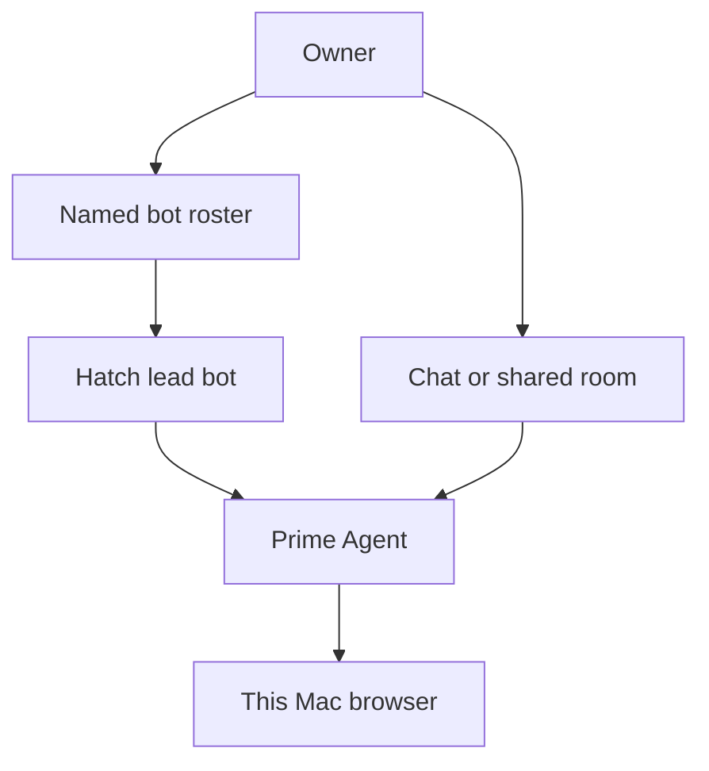
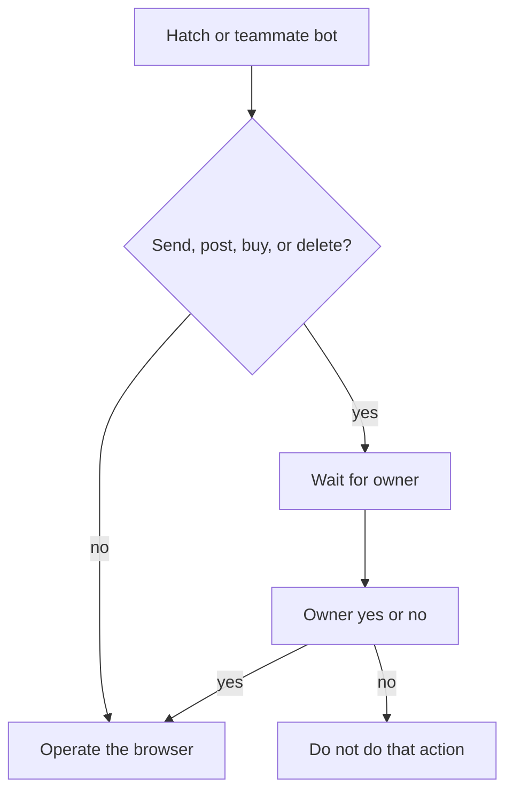

# Cohort - Plan

This file is archived history. It is not a run queue. Live requirements are in `ROADMAP.md`.

## Goal Capsule

- **Objective:** Redefine Cohort as the owner's open-source Grok Bot. Hatch is the lead bot: it hatches teammates, can coordinate, and sits with them in a shared room. Browser hands on this Mac, Prime Agent as the kernel, bring-your-own models, only while the app is open.
- **Product authority:** `AGENTS.md` and `ROADMAP.md` carry Cohort identity. This Product Contract wins on R/A/F/AE behavior. Company-scale use, a remote computer, native Mac apps, and overnight work are not active scope. This branch redefines the product; it does not implement the reshape.
- **Open blockers:** None. Remaining items are deferred to planning or later product work.

---

## Product Contract

### Summary

Cohort is a local desktop product where the owner talks to named AI teammates. Hatch is the lead bot: it can hatch another bot and can coordinate. The owner can sit with Hatch and other bots in a shared room. Prime Agent runs the bots. They use the browser the owner is already logged into on this Mac, and they wait for the owner's yes before send, post, buy, or delete.

### Problem Frame

The owner already uses Grok Bot every day and treats that teammate-and-computer habit as the future. Grok Bot is closed, sits behind Cursor, meters weekly use, and will not take the model subscriptions the owner already pays for. Cohort today is a workspace roster with files and a sealed box, and no chat or agent loop. That is not a Grok Bot. If nothing ships, the owner keeps paying that lock-in. Company-scale Cohort is why this would still matter if Grok Bot later took other models; that scale is not this slice.

### Key Decisions

- **Product is Cohort. Hatch is the lead bot.** (session-settled: user-directed — chosen over renaming the product Hatch: Hatch is the bot that hatches and coordinates) Governs R1, R5, R6.
- **Bots, not a workspace home.** Named bots are the roster. Hatch is on it. (session-settled: user-directed — chosen over keep workspaces as home, or one Mac with no roster: Grok Bot's home is bots) Governs R1, R3, R4.
- **You first.** v1 is the owner replacing a personal Grok Bot habit. (session-settled: user-directed — chosen over company-first or one operator running Cohort for coworkers: company-scale is later) Governs R2.
- **This Mac, browser, while open.** The computer is the owner's machine for the session. Hands are the logged-in browser. Work stops when Cohort is not open. (session-settled: user-directed — chosen over sealed sandbox, native apps in v1, remote computer now, or 24/7 with the lid closed: remote and overnight wait) Governs R8, R9, R10, R12.
- **Shared login, not a computer per bot.** Bots share the owner's logged-in browser on this Mac. (session-settled: user-approved — chosen over a separate browser identity per bot: one Mac, sites already logged in) Governs R9.
- **Crew plus a shared room.** The owner messages Hatch and hatched bots as teammates and can sit in a group thread with several at once. (session-settled: user-directed — chosen over DM-only crew or talk-only-to-the-lead: closest to Grok Bot's many-at-once) Governs R4, R7.
- **Hatch hatches and coordinates.** Hatch creates named bots. Hatch can run as coordinator. (session-settled: user-directed — chosen over a first vertical like inbox as the smallest slice: the crew is the product) Governs R5, R6.
- **Prime Agent kernel plus browser hands.** Embed Prime Agent. Do not shell out to the Prime CLI. A computer-use driver operates the browser. (session-settled: user-directed — chosen over Hermes, Pi, writing a kernel, or kernel-only without GUI hands: speed without dropping Grok Bot's hands) Governs R10, R13, R14.
- **Ask first on hard browser moves.** Send, post, buy, and delete wait for the owner. The owner is the only approver, including in a group room. (session-settled: user-directed — chosen over act-then-tell or per-bot defaults: Grok Bot comes back for approval) Governs R11.
- **Bring-your-own models, no Cohort weekly cap.** The owner uses subscriptions they already pay for. Cohort does not meter a weekly quota. (session-settled: user-directed — chosen over staying on Grok/Cursor usage: the Tuesday change) Governs R14.

### How This Work Fits Together

This plan owns Cohort as the owner's Grok Bot replacement, with Hatch as the lead bot. The breakdown below is the current understanding, not a committed roadmap.

- Native Mac apps as hands
  - Depends on browser hands working
  - Still to decide as later product work
- Hosted remote computer
  - Enables overnight and lid-closed work
  - Still to decide as later product work
- Company-scale Cohort
  - Depends on personal Cohort existing
  - Still to decide as later product work
- Workspaces and file inventory from the current app
  - Can proceed independently of the bot home
  - Still to decide; not implied by this plan

### Actors

- A1. Owner — the only user. Opens Cohort, talks to Hatch and other bots, joins a shared room, picks models, and approves hard browser actions.
- A2. Hatch — the lead bot. Can hatch other named bots and can coordinate them.
- A3. Teammate bot — a named bot Hatch has hatched. The owner can message it.
- A4. Shared room — a group thread with the owner, Hatch, and one or more teammate bots.
- A5. This Mac's browser — the logged-in browser bots share for hands.
- A6. Prime Agent — the embedded kernel that runs bots. Not the Prime CLI.

### Requirements

**Identity**

- R1. Cohort is the owner's local desktop open-source alternative to Grok Bot: named AI teammates that take real work, not a chatbot and not a workspace file manager. Hatch is the lead bot, not the product name.
- R2. The only user of this slice is the owner.

**Roster, hatch, coordinate**

- R3. Cohort's home is a roster of named bots, not a workspace list. Hatch is on that roster.
- R4. The owner messages Hatch and hatched bots as teammates.
- R5. Hatch can hatch another named bot that then appears on the roster.
- R6. Hatch can act as coordinator for other bots.

**Shared room**

- R7. The owner can join a shared room with Hatch and several bots at once, and those bots can talk in that room.

**Computer and hands**

- R8. While Cohort is open, the computer is this Mac.
- R9. Hands in this slice are the browser the owner is already logged into. Bots share that one login. They do not each get a separate browser identity.
- R10. A worker bot can operate that browser to do work.

**Approvals and lifetime**

- R11. Before send, post, buy, or delete in the browser, the bot stops and waits for the owner's yes. The owner is the only approver, including in a shared room.
- R12. Closing Cohort stops bot work. Overnight and lid-closed work are out of this slice.

**Runtime and models**

- R13. Prime Agent is embedded as the kernel. Cohort does not shell out to the Prime CLI as the kernel.
- R14. The owner brings their own model subscriptions. Cohort does not impose a weekly usage cap.

### Key Flows

- F1. Open Cohort and talk
  - **Trigger:** Owner opens Cohort.
  - **Actors:** A1, A2, A6
  - **Steps:** Owner sees named bots with Hatch as the lead. Owner messages Hatch. Prime Agent runs Hatch.
  - **Outcome:** Owner is in a teammate chat, not a workspace.
  - **Covered by:** R3, R4, R13

- F2. Hatch a bot
  - **Trigger:** Owner asks Hatch to create another bot, or Hatch hatches one while coordinating work.
  - **Actors:** A1, A2, A3, A6
  - **Steps:** Hatch hatches a new named bot. The new bot appears on the roster. Owner can message it.
  - **Outcome:** The crew grew by one named teammate.
  - **Covered by:** R5

- F3. Shared room
  - **Trigger:** Owner opens or creates a room with Hatch and at least one other bot.
  - **Actors:** A1, A2, A3, A4, A6
  - **Steps:** Owner, Hatch, and those bots share one thread. Hatch may assign work in that room.
  - **Outcome:** Owner is not the paste-between-chats router.
  - **Covered by:** R6, R7

- F4. Browser work with ask-first
  - **Trigger:** A bot needs to do work on a site the owner is logged into.
  - **Actors:** A1, A2, A3, A5, A6
  - **Steps:** The bot operates the shared browser. On send, post, buy, or delete it stops. Owner says yes or no. Other browser work may proceed without that gate.
  - **Outcome:** Work lands in the real site only after the owner approves the hard move.
  - **Covered by:** R8, R9, R10, R11

- F5. Leave
  - **Trigger:** Owner closes Cohort or the Mac is no longer a live session.
  - **Actors:** A1, A2, A3, A6
  - **Steps:** Running bot work stops. Nothing continues overnight on this Mac.
  - **Outcome:** No 24/7 teammate until a later remote computer.
  - **Covered by:** R12

### Acceptance Examples

- AE1. Hatch from Hatch
  - **Covers R5.**
  - **Given:** Hatch is on the roster.
  - **When:** Hatch hatches another bot.
  - **Then:** A new named bot is on the roster and the owner can message it.

- AE2. Hatch coordinates in a room
  - **Covers R6, R7.**
  - **Given:** Hatch, at least one teammate bot, and a shared room.
  - **When:** Hatch acts as coordinator.
  - **Then:** The owner can watch and talk in that room without pasting between separate chats.

- AE3. Ask-first send
  - **Covers R11.**
  - **Given:** A bot is in the owner's logged-in browser.
  - **When:** It is about to send a message on a site.
  - **Then:** It does not send until the owner says yes.

- AE4. Group room does not approve for the owner
  - **Covers R11.**
  - **Given:** A shared room with Hatch and other bots.
  - **When:** A bot in that room is about to buy or delete in the browser.
  - **Then:** Only the owner can approve. Hatch cannot approve for the owner.

- AE5. Close Cohort
  - **Covers R12.**
  - **Given:** Bots are running work in the browser.
  - **When:** Owner closes Cohort.
  - **Then:** That work stops. It does not continue with the lid closed.

- AE6. No Cohort weekly cap
  - **Covers R14.**
  - **Given:** Owner has connected a model subscription.
  - **When:** Owner keeps handing work to Hatch and other bots during the week.
  - **Then:** Cohort does not stop them for a Cohort weekly quota. The model provider's own limits still apply.

- AE7. Not a workspace home
  - **Covers R1, R3.**
  - **Given:** Owner launches Cohort.
  - **When:** The window opens.
  - **Then:** The home is named bots with Hatch as the lead, not the current workspace roster.

### Success Criteria

- S1. On a Tuesday the owner can do a Grok Bot-shaped job in Cohort instead: talk to Hatch, hatch a teammate, sit in a shared room, and have a worker use the logged-in browser with ask-first.
- S2. That Tuesday does not require Cursor, a Grok Bot plan, or a Cohort weekly quota.
- S3. Closing Cohort is enough to stop the bots. The owner does not need a cloud computer for this slice to feel safe.

### Scope Boundaries

**Deferred for later**

- Native Mac apps as hands
- A hosted remote computer
- Overnight and lid-closed work
- Company-scale use and other users
- iOS
- Grok Bot-style learned routines and 24/7 schedules
- Whether any file inventory from the current app remains on screen

**Outside this product's identity**

- Renaming the product Hatch
- A sealed workspace sandbox as the computer bots live in
- A captain that cannot leave a workspace box
- Workspaces as the home screen
- Shelling out to the Prime CLI as the kernel
- Hermes, Pi, or a from-scratch kernel as the v1 engine
- A Cohort-imposed weekly usage cap
- A multi-user or company control plane in this slice

### Dependencies / Assumptions

- Prime Agent (Prime Intellect, MIT) can be embedded in the Cohort desktop app as the kernel, with Hatch's hatch mapping to its child-agent model.
- A computer-use path can operate the owner's logged-in browser on this Mac. Planning picks the driver.
- The owner already pays for at least one model subscription they will connect.
- Bots sharing one browser login is acceptable for v1. A login on this Mac is available to Hatch and every teammate bot.
- The current workspace loop (roster, add-files, Boxlite box) is leftover, not Cohort's home. It is not deleted by this contract and is not required for acceptance.

### Outstanding Questions

**Deferred to Planning**

- How Prime Agent is embedded (library, in-process host, not the CLI).
- Which computer-use driver operates the browser on this Mac.
- Which browser is attached (the owner's daily browser vs a Cohort-owned window on the same login).
- How Hatch, named bots, roster, and shared rooms persist across reopen while still stopping work on close.
- How the owner connects model subscriptions.
- Whether any file inventory remains visible anywhere once bots are home.

### Sources / Research

- Grok Bot product: [https://x.ai/bot](https://x.ai/bot) and [https://docs.x.ai/grok-bot/overview](https://docs.x.ai/grok-bot/overview) — named teammates, own computer, shared logins, approval, many bots at once.
- Prime Agent: [https://github.com/PrimeIntellect-ai/prime-agent](https://github.com/PrimeIntellect-ai/prime-agent) — MIT RLM kernel, persistent children via `rlm()`, embed rather than Prime CLI.
- `AGENTS.md` and `ROADMAP.md` — Cohort identity. This contract supersedes sandbox-as-computer and workspace-as-home. Hatch is the lead bot.
- `docs/archive/2026-08-13-1656-feat-cohort-desktop-workspace-loop-plan.md` and `docs/archive/2026-08-14-1026-feat-workspace-files-sidebar-plan.md` — shipped loop is workspace roster, add-files, Boxlite `/workspace`, look-only files rail. No chat or agent APIs in `src/` (schema is workspaces + meta; IPC is list/create/setCurrent/addFiles).
