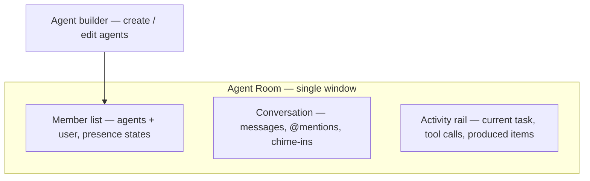
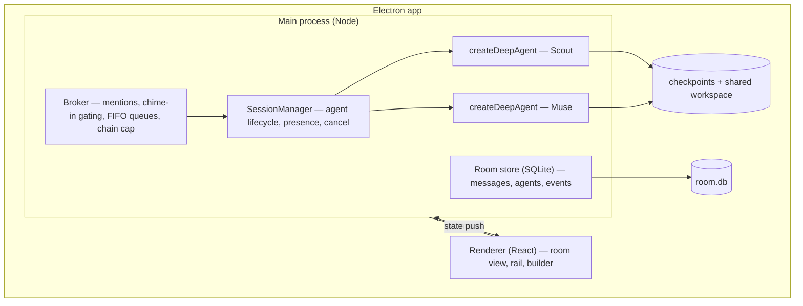
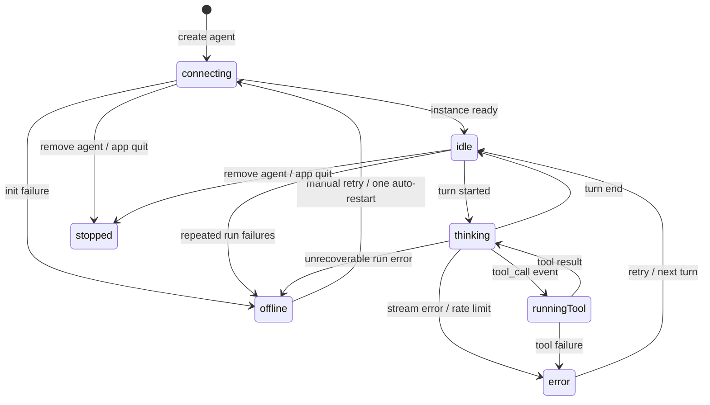

# Agent Room - Plan

## Goal Capsule

- **Objective:** Build v1 of Agent Room: a local desktop app that is a single shared room where the user hangs out and works alongside a team of deepagents-powered agents they create in-app.
- **Product authority:** This document. Product Contract preservation: unchanged except Q1/Q2 marked resolved (answers recorded as KTD8/KTD9); R/A/F/AE IDs and behavior text untouched.
- **Execution profile:** `code`. Executors consume U1–U8 in dependency order; each unit lands as an atomic commit.
- **Stop conditions:** escalate instead of guessing if U5 finds the deepagents TS SDK's memory, streaming, or invocation claims failing in practice (that invalidates a settled decision), or if `updateState` message injection misbehaves under the summarization middleware.
- **Tail ownership:** the executor runs the Verification Contract gates and the Definition of Done; PR strategy follows repo conventions once they exist.
- **Open blockers:** None. Remaining unknowns are implementation-time and recorded as deferred notes in the Planning Contract.

---

## Product Contract

### Summary

Agent Room is a local Electron app that distills Discord to one room where the user and their self-built agents are co-present members. Conversation is the room's center; a live activity rail shows what each agent is doing right now. Room history persists across sessions, and agents resume with managed memory of earlier work.

### Problem Frame

The user wants to start running agent teams but has no place where that happens today. Running several agents means scattered terminal sessions and logs, with no shared surface where the user and agents are present together. The cost is that working with agent teams never starts: there is no room to hang out in, watch, and steer. Existing chat tools treat bots as add-ons to human conversation; nothing the user has treats agents as first-class members of a shared space.

### Key Decisions

- **One room, not Discord's full structure.** v1 validates the co-presence value — hanging out with a team of agents — before building servers, channels, or DMs. The smallest version the user would actually build first is one room with N agents.
- **Conversation-first core with a live activity rail.** Chat is the center of the room; a rail streams each agent's current activity so "what is everyone doing" is visible without reading scrollback. Chosen over a pure-chat room (work output gets buried) and over lead-agent orchestration (a manager agent becomes a bottleneck and weakens the peer-like hangout feel).
- **Local-only, app-spawned agents.** The app creates and manages the agents on the user's machine. Agents run while the app is open and stop when it closes. Chosen over connecting to remote or independently running agents.
- **Agents as first-class members.** Agents have names, avatars, and presence states, and participate as peers in the room. Agent-native design is the intended differentiator against incumbent chat tools adding bots.
- **Persistent history with managed agent memory.** Room history persists across sessions. Agents resume with recent messages verbatim plus older history summarized, so context stays bounded. Room-level defaults with per-agent overrides in the builder. (user-approved — agent recommendation surfaced with the context-overflow tradeoff; the user assented.)
- **In-app agent builder.** Agents are created and edited inside the app: name, avatar, persona/instructions, model, and tool set. Chosen over config-file discovery and over fixed built-in personas.



### Actors

- A1. **The user** — the sole human participant and operator; dogfooding first user.
- A2. **Room agents** — deepagents instances created in-app, running locally inside the app; first-class members of the room.

### Requirements

**Room and conversation**

- R1. The app presents a single persistent room where the user and all agents are co-present participants in one conversation.
- R2. The user can address a specific agent by @mention, and the mentioned agent responds.
- R3. Agents may speak unaddressed when they judge their contribution relevant; not every agent responds to every message.
- R4. Room history persists across app restarts and is fully browsable.
- R12. Agents see all room messages, but only user messages and explicit @mentions (from the user or another agent) can trigger an agent response; an agent's own messages never recursively trigger other agents.
- R13. v1's default chime-in policy is restrained: agents speak unaddressed only when a message is highly relevant to their persona, and the user can tune chattiness.

**Agents as members**

- R5. Each agent appears as a first-class member with name, avatar, and live presence state (idle, thinking, running a tool, offline). Offline indicates an agent that failed to start or has stopped unexpectedly while the app is open.
- R6. The user can create and edit agents in-app: name, avatar, persona/instructions, model, and tool set. The user can also remove an agent: it leaves the member list and stops running, while its past messages remain in room history attributed to its name and avatar.
- R7. Agents are created and run locally by the app while the app is open and stop when it closes.

**Activity visibility**

- R8. A live activity rail shows each agent's current activity — active task, recent tool calls, and produced items — without reading scrollback.

**Memory and continuity**

- R9. On app relaunch, agents resume with awareness of prior room history: recent messages verbatim plus older history summarized, keeping context bounded.
- R10. Memory behavior has room-level defaults with per-agent overrides configurable in the agent builder.

**Experience quality**

- R11. The room experience meets a demo-able bar: messaging, member presence, and activity updates feel live and polished.

### Key Flows

- F1. Start a session
  - **Trigger:** The user opens the app.
  - **Actors:** A1, A2
  - **Steps:** The room loads with its full history; agents start and come online with presence; the user picks up where they left off. On the first launch with no agents, the room shows an empty state that routes the user into the agent builder, and the composer is unavailable until at least one agent exists.
  - **Covered by:** R1, R4, R5, R7, R9
- F2. Direct a task
  - **Trigger:** The user @mentions an agent with a request.
  - **Actors:** A1, A2
  - **Steps:** The agent acknowledges in chat; the activity rail shows its task and tool calls while it works; the agent reports the result in chat.
  - **Covered by:** R2, R8
- F3. Create an agent
  - **Trigger:** The user opens the agent builder.
  - **Actors:** A1
  - **Steps:** The user defines name, avatar, persona/instructions, model, and tool set; the new agent joins the room as a member.
  - **Covered by:** R5, R6
- F4. Ambient collaboration
  - **Trigger:** The user posts a message with no @mention.
  - **Actors:** A1, A2
  - **Steps:** Zero or more agents chime in when relevant; the user steers the resulting conversation.
  - **Covered by:** R3
- F5. Agent fails
  - **Trigger:** An agent fails to start, errors mid-task, or stops responding.
  - **Actors:** A1, A2
  - **Steps:** The agent's presence transitions to an error/offline state; the activity rail marks the task failed; the failure is reported in chat with a retry affordance.
  - **Covered by:** R5, R7, R8

### Acceptance Examples

- AE1.
  - **Covers:** R2
  - **Given** agents Scout and Muse are in the room, **when** the user sends "@Scout why is the parser slow?", **then** Scout responds in the room and Muse stays silent unless she judges the message relevant to her persona (per R3).
- AE2.
  - **Covers:** R3
  - **Given** no @mention, **when** the user posts a message relevant to one agent's persona, **then** that agent may chime in, and the other agents do not all respond.
- AE3.
  - **Covers:** R7, R9
  - **Given** an ongoing conversation, **when** the user quits and relaunches the app, **then** the full history is visible, agents come back online, and agents can refer to earlier work without holding the full transcript in context.
- AE4.
  - **Covers:** R8
  - **Given** an agent is mid-task, **when** the user glances at the activity rail, **then** the agent's current task and recent tool calls are visible without scrolling the chat.

### Success Criteria

- **Daily driver:** within six weeks of v1, the user genuinely uses Agent Room as the home for their agent work.
- **Concept validation:** the user can say from experience whether a co-present human+agent room is a good interaction model; a negative answer still counts as success.
- **Demo-able artifact:** the app can be shown to others as a coherent, polished whole.

### Scope Boundaries

**Deferred for later**

- Multi-server, channels, DMs, and threads — the rest of Discord's structure.
- Voice/video, roles/permissions, and message search.
- Remote agents, and agents that keep working while the app is closed (a background daemon).
- Lead-agent orchestration and visible delegation threads.
- Multi-human use of a room.

**Outside this product's identity**

- A general human chat product with bots bolted on. The room is agent-native; agents are first-class members, not add-ons.

### Dependencies / Assumptions

- **Assumption (demand):** demand for the app is hypothesized, not evidenced — the user has not run agent teams before, so v1 doubles as the demand test.
- **Dependency (memory):** the deepagents TS SDK provides checkpointing/summarization primitives sufficient for managed memory (R9). Planning verifies this before committing to a mechanism.
- **Dependency (activity/presence):** the deepagents TS SDK exposes streaming tool-call/task events and per-agent state introspection sufficient for presence states (R5) and the activity rail (R8). Planning verifies before committing to a mechanism.
- **Dependency (chime-in):** a relevance-gating mechanism for ambient chime-in (R3) is implementable at acceptable cost and latency per message. Planning verifies.

Planning verification outcome: all three dependencies **confirmed** against current deepagents TypeScript SDK documentation — see Sources / Research in the Planning Contract. The mechanisms appear in KTD6, KTD8, and KTD10, landing in U4 and U5.

### Outstanding Questions

None open. Q1 (chime-in tuning) resolved in planning as KTD8 — persona-text tuning, no dedicated control. Q2 (builder defaults) resolved in planning as KTD9 — starter presets.

---

## Planning Contract

The Product Contract says what the room is; this contract says how it gets built. The implementation shape in one paragraph: agents are `createDeepAgent` instances (LangChain's deepagents TypeScript SDK) living in the Electron main process — no sidecar processes and no wire protocol. A main-process broker decides who speaks when; a local SQLite room store is the source of truth for history; each agent persists memory through a SQLite LangGraph checkpointer with default summarization; the React renderer only renders room state.

### Key Technical Decisions

**Host architecture**

- **KTD1. Agents run in-process in the Electron main process; the renderer is a pure view.** Each room member is a `createDeepAgent` instance created and owned by a main-process session manager. There are no child processes: presence comes from run events, not process liveness. The renderer sends intents over Electron IPC and renders streamed room state.
- **KTD2. Turns are in-process invocations with AbortController cancellation; there is no wire protocol.** A turn runner wraps each agent's streaming call, maps LangGraph events to room events (token, tool call, status), and cancels via an `AbortController` per turn. This replaces the originally planned stdio JSON-RPC protocol — in-process agents need no transport.
- **KTD3. The LangChain stack is the TypeScript SDK (`deepagents` on npm), not Python.** All agents, memory, streaming, and tools use the JS SDK (v1.x, stable) inside Electron's Node runtime. (session-settled: user-directed — chosen over the Python `deepagents` sidecar with a uv-managed environment: user direction, mid-planning.)
- **KTD4. The room store is the source of truth; each agent's memory is a derived per-agent view.** Room history lives in a local SQLite store with sequence IDs. Each agent keeps a LangGraph `thread_id`; messages an agent missed while away are replayed into its context. Summarization is per-agent, so an agent's recall of old history may legitimately diverge from the room's verbatim record.

**Agent runtime**

- **KTD5. A broker owns turn-taking: per-agent FIFO queues, no preemption, bounded chains.** Each agent has a FIFO queue; messages arriving mid-turn fold into the agent's next turn and the current turn is never preempted. Agent→agent mention chains are capped at depth 3 per user message, and room membership is capped at 8 agents — both guard runaway chatter and token burn. (Chain depth and agent cap: session-settled via the pre-write scope confirmation.)
- **KTD6. Managed memory uses a SQLite checkpointer plus the SDK's default summarization middleware.** Each agent gets a `SqliteSaver` (`@langchain/langgraph-checkpoint-sqlite`) file and a stable `thread_id`; relaunch rebuilds the agent against the same file. The default `SummarizationMiddleware` (in the `createDeepAgent` stack since SDK 1.6.0) keeps recent messages verbatim and summarizes older ones — the exact recent-verbatim-plus-summarized shape the Product Contract settled. (session-settled: user-approved — chosen over fresh-context-per-session and full verbatim replay: bounded context without losing continuity; instantiates the Product Contract's managed-memory Key Decision.)
- **KTD7. Quitting mid-task cancels; nothing auto-resumes.** On quit, in-flight turns are aborted via their controllers, an interruption marker is written to the room, and pending checkpoint writes are flushed before exit. On relaunch, agents continue from checkpointed memory on their next invocation — the room resumes from memory, not half-finished work. (session-settled via the pre-write scope confirmation.)
- **KTD10. Pin `deepagents@1.11.1` and use the stable streaming API.** Turns stream via `stream` with `streamMode` `updates`/`messages` and `subgraphs: true`; the newer `streamEvents` v3 projection API is explicitly experimental and avoided until it stabilizes.
- **KTD12. Room and broker are proven against a stub model before live LLM wiring.** A deterministic stub chat model (scripted replies and tool calls) drives all unit and integration tests, so broker routing, presence transitions, cancellation, and the rail are testable without model access. Live-model behavior is verified at the U5 integration seam and the smoke gate.

**Product mechanisms**

- **KTD8. Chattiness is tuned through persona text; there is no dedicated control.** Restrained chime-in (R13) ships as persona wording in the presets, and the user tunes it by editing personas. The broker's relevance gate passes each agent its persona as the judging rubric. (session-settled: user-directed — chosen over a per-agent chattiness setting and a room-level setting: least UI surface for v1, personality stays in one place.)
- **KTD9. The builder ships starter presets.** Three presets (Researcher, Coder, Writer) pre-fill model, tool set, and persona — with restrained-chime-in persona wording baked in (KTD8). (session-settled: user-directed — chosen over blank-slate and defaults-only: best first-run and demo experience.)
- **KTD11. Agents share one room workspace directory, jailed by the SDK's filesystem backend.** File tools run through `FilesystemBackend({ rootDir: <room workspace>, virtualMode: true })` — `virtualMode` is what enforces the jail; the activity rail derives "produced items" from workspace changes during a turn. Chosen over per-agent sandboxes so agents can see and build on each other's output. (Confirmed via the pre-write scope confirmation.)

**Agent tool surface**

- **KTD13. v1 approval posture is full autonomy within a constrained tool surface.** No approval UI, no `interruptOn` gates. For a single-user local app, the cheaper control is restricting what tools exist, not gating when they fire; the workspace is not the source of truth (the room store is), so worst-case tool damage is redo-able work.
- **KTD14. No shell/execute tool ships in v1.** Shell is the one tool class whose blast radius exceeds the workspace (room store, checkpoint DBs, the OS). A Coder agent works through files and asks the user in-room to run builds and tests — co-presence supplies the execution loop, and approval plumbing stays out of v1.
- **KTD15. The workspace jail is enforced at the backend, not by convention.** `virtualMode: true` on the shared `FilesystemBackend` blocks `..`, `~`, and absolute paths outside the root; `permissions` rules add declarative allow/deny on top where needed.
- **KTD16. Every agent turn carries a room-context envelope: the member roster and author-attributed messages.** The roster (names plus one-line personas) lets agents address each other reliably instead of hallucinating recipient names; author attribution keeps multi-party history from reading as one voice, for live turns and replayed messages alike.

### High-Level Technical Design

Process topology — one process boundary, everything else in-process:



Presence state machine (drives member list and rail):



Message routing for @mentions and chime-in (per user message):

```mermaid
sequenceDiagram
  participant U as User
  participant B as Broker
  participant S as Room store
  participant A as Mentioned agent
  participant M as Other agents
  U->>B: message (with or without @mention)
  B->>S: append message (sequence id)
  alt @mention present
    B->>A: enqueue turn (FIFO; folds in if busy)
    B->>M: record for replay on next invocation
  else no @mention
    B->>M: relevance gate (persona as rubric)
    M-->>B: zero or more agents opt in
    B->>M: enqueue turns for opted-in agents only
  end
  A-->>B: streamed events (tokens, tool calls, status)
  B->>S: append events + final message
  Note over B,M: agent→agent @mentions allowed, capped at depth 3 per user message
```

Turn runner event contract (directional, not implementation specification):

```text
runTurn(agent, messages, signal) → AsyncIterable<RoomEvent>
RoomEvent = { kind: "token", text }
          | { kind: "tool_call.start", name, input }
          | { kind: "tool_call.end", name, output?, error? }
          | { kind: "status", phase: "thinking" | "running-tool" | "idle" }
          | { kind: "turn.end", reason: "done" | "cancelled" | "error" }
cancel: AbortController.abort() → stream closes with turn.end(cancelled)
```

### Output Structure

```text
package.json                      # electron-vite workspace; deepagents pin; @electron/rebuild
electron.vite.config.ts
tsconfig.json
src/
  main/                           # Electron main process
    index.ts                      # app lifecycle, quit ordering, flush on quit
    settings.ts                   # settings + safeStorage keys (U1)
    room-store.ts                 # SQLite room store (U4)
    broker.ts                     # mentions, gating, queues (U4)
    mentions.ts                   # @mention parsing (U4)
    activity-projector.ts         # events → rail projection (U7)
    agent-config.ts               # builder config + presets (U8)
    agents/
      agent-factory.ts            # createDeepAgent wrapper (U2)
      turn-runner.ts              # run/cancel, event mapping (U2)
      stub-model.ts               # deterministic test model (U2)
      session-manager.ts          # lifecycle, restart policy (U3)
      presence.ts                 # presence state machine (U3)
      room-context.ts             # roster + attribution envelope (U5)
      workspace.ts                # shared jailed workspace (U5)
  preload/
  renderer/src/                   # React app
    components/                   # Room, MessageList, MessageBubble, MemberList,
                                  # Composer, ActivityRail, ToolCallCard,
                                  # AgentBuilder, PresetPicker, SettingsPane
```

### Sequencing

Units group into three phases. Phase boundaries are for clarity only; each unit still lands as an atomic commit.

- **Phase 1 — Foundation:** U1 (scaffold + settings), U2 (agent runtime seam + stub model), U3 (session manager + presence). Ends with supervised stub-model agents that survive error and quit matrices.
- **Phase 2 — Runtime:** U4 (room store + broker), U5 (memory + workspace integration). Ends with real agents talking in a headless room with persistent memory.
- **Phase 3 — Experience:** U6 (room UI), U7 (activity rail), U8 (builder + presets). Ends with the demo-able v1.

### Deferred Implementation Notes

- `updateState` on the JS `DeepAgent`/`ReactAgent` is typed `@internal` (works at runtime, needs a cast) — verify in U5; the supported fallback is including missed messages in the next invocation's input.
- `better-sqlite3` is a native module — U1 wires `@electron/rebuild`; packaging would additionally need `asarUnpack` (v1 runs unpackaged in dev).
- Exact preset tool implementations (web fetch, workspace operations) — plain TS `tool()` definitions with zod schemas; keep them minimal.
- Multi-@mention in one message — v1 treats the first mention as the target; revisit later.
- Exact relevance-gate model and prompt — a cheap fast model; tune against dogfooding.

### Risks & Dependencies

- **deepagents JS is 1.x but young.** Pin 1.11.1; upgrade deliberately. The v3 streaming projections are experimental (KTD10 avoids them); the default summarization middleware is recent (≥1.6.0) — test compaction behavior in U5 before trusting it (KTD6).
- **`updateState` is an unofficial surface** (typed `@internal`) — the replay path has a supported fallback (next-invoke injection); U5 verifies before relying on it.
- **Relevance gating costs one cheap model call per agent per unaddressed message.** Batch where possible; the 8-agent cap (KTD5) bounds this.
- **Electron's Node version must satisfy the SDK floor (Node ≥ 20)** — current Electron majors are well past this; U1 pins the Electron version and verifies.
- **Workspace write contention:** two agents writing the same file in overlapping turns is last-write-wins. Acceptable in v1 because the room record of intent survives and the rail shows produced items per turn; serialization is a recorded non-goal, not an emergent gap.
- **The no-approval posture (KTD13) is calibrated to a shell-free, workspace-jailed tool set.** Adding shell or wider file access later without revisiting KTD13/KTD14 silently undefends it.
- **N=1 validation risk:** the success criteria depend on one dogfooding user; nothing in the build mitigates that — it is the design.

### Sources / Research

Framework research (2026-07-22) verified the Product Contract's three dependencies as CONFIRMED against the deepagents **TypeScript SDK** (`deepagents@1.11.1` on npm, official LangChain package):

- Memory: `createDeepAgent({ checkpointer })` with `SqliteSaver.fromConnString(...)` keyed by `thread_id`; `SummarizationMiddleware` in the default stack since 1.6.0 (recent verbatim + older summarized, full history offloaded). docs.langchain.com/oss/javascript/deepagents/{memory,context-engineering}, /oss/javascript/langgraph/checkpointers
- Activity streaming: `stream` with `streamMode` `updates`/`messages`, `subgraphs: true`; subagent activity visible via stream namespaces; experimental `streamEvents` v3 projections exist but are avoided (KTD10). docs.langchain.com/oss/javascript/deepagents/streaming
- Response gating: no automatic broadcast; the host invokes agents programmatically per message; message injection without a reply via `updateState` (typed `@internal`, with a supported next-invoke fallback). docs.langchain.com/oss/javascript/deepagents/overview
- Workspace jail: `FilesystemBackend({ rootDir, virtualMode: true })` — docs explicitly warn `virtualMode: false` (the default) provides no containment; `permissions` adds declarative rules. docs.langchain.com/oss/javascript/deepagents/{backends,permissions}

Host-architecture research grounded KTD1–KTD3: Electron process model docs, npm registry metadata for `deepagents` and `@langchain/langgraph-checkpoint-sqlite`. Chat-UI patterns (typed event streams, throttled rendering, state-driven presence) follow LangGraph streaming docs and converged agent-IDE prior art (Claude Code, Cursor, Zed).

---

## Implementation Units

### U1. App scaffold and settings

**Goal:** A runnable Electron+React shell with the deepagents TS SDK installed, native modules rebuilt for Electron, and settings storage with secure API keys.

**Requirements:** R6, R11; F1 first-run (credential onboarding)

**Dependencies:** none

**Files:** `package.json`, `electron.vite.config.ts`, `tsconfig.json`, `src/main/index.ts`, `src/main/settings.ts`, `src/preload/index.ts`, `src/renderer/index.html`, `src/renderer/src/main.tsx`, `src/main/__tests__/settings.test.ts`

**Approach:** electron-vite scaffold (React + TypeScript). Dependencies include `deepagents@1.11.1`, `@langchain/langgraph-checkpoint-sqlite`, `better-sqlite3`, and `zod`, with `@electron/rebuild` as a postinstall step so the native SQLite module loads inside Electron's Node. Pin an Electron major whose Node satisfies the SDK's ≥20 floor and verify it on startup. Settings persist as JSON under userData; LLM API keys are stored via Electron `safeStorage`, never in plain settings. Key validation is a minimal preflight model call before the key is accepted. The renderer runs hardened from day one: `contextIsolation`, `sandbox`, `nodeIntegration: false`, and a restrictive CSP.

**Test scenarios:**

- Happy path: install + launch opens a shell window; `better-sqlite3` loads in the main process without ABI errors.
- Edge: settings file missing on first launch → defaults created; corrupted settings JSON → backed up and recreated.
- Error: invalid API key → typed validation error, key not stored.
- Integration: settings round-trip survives app restart; keys are absent from the plain settings file; webPreferences flags verified present on the BrowserWindow.

**Verification:** the app launches to a shell window; `better-sqlite3` loads inside Electron; an invalid key is rejected with a clear message.

### U2. Agent runtime seam and stub model

**Goal:** An in-process agent runtime layer — factory, turn runner, event mapping, cancellation — plus a deterministic stub model that makes every downstream behavior testable without an LLM (KTD2, KTD12).

**Requirements:** foundation for R2, R5, R7, R8

**Dependencies:** U1

**Files:** `src/main/agents/agent-factory.ts`, `src/main/agents/turn-runner.ts`, `src/main/agents/stub-model.ts`, `src/main/agents/__tests__/turn-runner.test.ts`, `src/main/agents/__tests__/stub-model.test.ts`

**Approach:** The agent factory wraps `createDeepAgent`, translating builder config (model, persona, tool set, workspace, checkpointer) into an instance. The turn runner executes a turn per the HTD event contract: `runTurn(agent, messages, signal)` yields mapped `RoomEvent`s from the LangGraph stream (`streamMode` `updates`/`messages`, `subgraphs: true`), and an `AbortController` per turn provides cancellation. The stub model implements the chat-model interface with scripted replies and tool-call sequences, so streaming, cancellation, and error paths are deterministic in tests.

**Test scenarios:**

- Happy path: a scripted turn yields tokens, tool-call events, and `turn.end(done)` in order.
- Edge: multiple agents stream concurrently in one process with no event cross-talk.
- Error: cancel mid-stream → stream closes with `turn.end(cancelled)`; model error mid-stream → `turn.end(error)` with the error attached.
- Integration: tool-call args arriving chunked are reassembled into complete tool-call events.

**Verification:** the turn-runner suite passes against the stub model, including cancellation and concurrent agents.

### U3. Agent session manager and presence state machine

**Goal:** A main-process session manager that owns each agent's lifecycle and exposes truthful presence (KTD1).

**Requirements:** R5, R7; F5

**Dependencies:** U2

**Files:** `src/main/agents/session-manager.ts`, `src/main/agents/presence.ts`, `src/main/agents/__tests__/session-manager.test.ts`

**Approach:** States per the HTD diagram: `connecting → idle → thinking → runningTool → error/offline → stopped`. Agents instantiate from stored config at app launch; init failure lands in `offline` with a retry affordance. Presence transitions are driven by turn-runner events, never by token arrival. Failure taxonomy distinguishes auth errors (bad key), rate limits (retry with backoff), crashes (run errors), and hangs (per-turn wall-clock timeout). Crash policy: one automatic restart (recreate the instance) with backoff, then `offline` with manual retry — no restart loops. On app quit: abort in-flight turns, write interruption markers, flush checkpointer writes before exit.

**Test scenarios:**

- Model throws mid-turn → presence transitions through error to one auto-restart, then idle.
- Agent that fails init repeatedly → exactly one retry, then offline; no failure-message spam.
- Quit while three agents stream → turns abort, interruption markers written, no dangling timers or open DB handles after exit.
- Hang (turn exceeds the wall-clock timeout) → detected as unresponsive → F5 path.
- Message sent while an agent initializes → queued and delivered when ready (no loss).

**Verification:** the error/quit matrix (init failure | run error | hang | quit × idle | mid-turn) passes in integration tests with stub-model agents.

### U4. Room store and invocation broker

**Goal:** Persistent room history plus the routing brain that decides who speaks when (KTD4, KTD5).

**Requirements:** R1, R2, R3, R4, R12, R13; F2, F4

**Dependencies:** U3

**Files:** `src/main/room-store.ts`, `src/main/broker.ts`, `src/main/mentions.ts`, `src/main/__tests__/broker.test.ts`, `src/main/__tests__/room-store.test.ts`

**Approach:** The room store (SQLite via `better-sqlite3`) holds messages, agents, presence snapshots, and events with monotonic sequence IDs; it is the only history the UI reads. The broker maintains a per-agent FIFO queue with no preemption — messages for a busy agent fold into its next turn input. @mention parsing takes the first mention as the target. Chime-in: after an unaddressed user message, each other agent gets a cheap relevance judgment with its persona as the rubric (KTD8); only opted-in agents are invoked. Agent-originated @mentions are honored but capped at depth 3 per user message; hitting the cap writes a subtle system note. Agents that were away get missed messages replayed on their next invocation. Cancellation and interruption markers are first-class room-store entries.

**Test scenarios:**

- Covers AE1. Mention Scout → only Scout is invoked; Muse records the message for replay without replying.
- Covers AE2. Unaddressed message relevant to one persona → that agent chimes in; others stay silent.
- Chain cap: A mentions B, B mentions A — the chain stops at depth 3 with a system note.
- Agent output @mentions a non-existent member → the broker drops it with a system note; no chain budget is consumed.
- The chain budget also binds chains that originate from a chime-in turn, not only mention-originated ones — chime-ins cannot reset the cap.
- Burst: three rapid user messages → ordered delivery, no preemption, FIFO drains in order.
- Replay: agent offline for five messages → receives all five, marked as missed, on next turn.
- Soft cap: creating a ninth agent is refused with a clear reason.
- Store: messages, events, and interruption markers round-trip with stable sequence order across reopen.

**Verification:** broker and store suites pass with stub-model agents; AE1/AE2 scenarios green.

### U5. Memory and workspace integration

**Goal:** Real persistent managed memory and a jailed shared workspace on the deepagents TS SDK (KTD6, KTD10, KTD11, KTD15, KTD16).

**Requirements:** R5, R7, R8, R9, R10; F1, F3; AE3

**Dependencies:** U2, U3

**Files:** `src/main/agents/room-context.ts`, `src/main/agents/workspace.ts`, `src/main/agents/__tests__/memory.test.ts`, `src/main/agents/__tests__/workspace.test.ts`

**Approach:** Each agent gets a `SqliteSaver` checkpoint file and a stable `thread_id`; the default `SummarizationMiddleware` provides recent-verbatim plus summarized-older memory (KTD6). File tools run through one shared `FilesystemBackend({ rootDir: <room workspace>, virtualMode: true })` (KTD11, KTD15). Every invocation carries the room-context envelope — member roster and author-attributed message framing — applied to live turns and replay alike (KTD16). Replay injects missed messages via `updateState` (typed `@internal`; used behind a small wrapper) — verify reducer behavior first and fall back to folding missed messages into the next invocation input (Deferred Implementation Notes). At launch, validate each checkpoint DB; on corruption, back it up, start a fresh thread, and post a chat notice. If summarization fails at resume, fall back to truncating old history. Per-agent memory overrides (R10) are config fields in the agent config schema, passed to the middleware setup.

**Test scenarios:**

- Covers AE3. Talk to an agent, close and recreate it against the same checkpoint file → the agent refers to earlier work without the full transcript in context.
- Long history forces summarization → context stays bounded and the agent still answers about recent work.
- Tool-call and subagent events stream with correct ordering and namespaces against the real SDK.
- Corrupt checkpoint file → backup created, fresh thread starts, chat notice emitted.
- `updateState` injection → message lands in history with no generated reply.
- Agent attempts a file write outside the workspace jail → typed denial; the failure surfaces for the rail and presence recovers (KTD15).
- After replay, agent B refers to an earlier message of agent A by A's name — attribution and roster survive replay (KTD16).
- Per-agent override: one agent with summarization disabled keeps full verbatim context while others summarize (R10).

**Verification:** integration tests against the pinned SDK with the stub model where possible and a cheap live model at the seam; the AE3 memory-resume scenario passes end to end.

### U6. Room UI: conversation, members, composer

**Goal:** The conversation-first room surface (R11 demo-able bar).

**Requirements:** R1, R2, R4, R5, R11; F1 (first-run), F2, F5 (error surface); cancellation affordance

**Dependencies:** U4

**Files:** `src/renderer/src/App.tsx`, `src/renderer/src/components/Room.tsx`, `src/renderer/src/components/MessageList.tsx`, `src/renderer/src/components/MessageBubble.tsx`, `src/renderer/src/components/MemberList.tsx`, `src/renderer/src/components/Composer.tsx`, `src/renderer/src/components/__tests__/room.test.tsx`

**Approach:** Virtualized message list rendering from the room store. Streaming bubbles buffer deltas and flush per animation frame; markdown renders incrementally with memoized blocks that tolerate unterminated fences, sanitized with raw HTML disabled and http/https links only. The member list shows presence dots and a per-agent status line driven by the U3 state machine ("running search_web…"), never by token arrival. First launch with no agents shows the empty state routing into the builder; the composer stays disabled until one agent exists (F1). Typing `@` opens a member autocomplete; Enter sends, Shift+Enter newlines; the composer shows a sending state until the message lands and retains drafts on failure. Agent failures surface inline in chat with a retry affordance (F5); auth failures get a distinct surface ("Scout can't reach the model — check the API key"). A stop affordance on the member-list row and the streaming bubble sends cancellation; a cancelled turn preserves the partial message with an inline "interrupted" marker. System entries (chain-cap notes, removal notes, corruption notices, interruption markers) render as a muted, avatar-less system row type. The member list carries a persistent "New agent" affordance and per-agent actions (edit, remove).

**Test scenarios:**

- Room history renders on relaunch in stored order (R4).
- Presence transitions reflect in the member list without stale "typing" states after a crash.
- Streaming updates re-render throttled, not per token.
- First-run: empty state visible, composer disabled; after creating an agent, composer enables.
- Mention autocomplete inserts a structured mention; Enter sends; failed send retains the draft.
- Failure surface: crashed agent shows inline error + retry; retry restarts the agent.
- Stop during a live turn → partial message kept with an "interrupted" marker and presence returns to idle.
- System entries render in the muted system style, distinct from member messages.

**Verification:** component tests for the above; a manual daily-session smoke (open → history → mention → reply → presence changes) feels live.

### U7. Activity rail

**Goal:** A live per-agent activity view that answers "what is everyone doing" without scrollback.

**Requirements:** R8; F2; AE4

**Dependencies:** U5, U6

**Files:** `src/renderer/src/components/ActivityRail.tsx`, `src/renderer/src/components/ToolCallCard.tsx`, `src/main/activity-projector.ts`, `src/renderer/src/components/__tests__/activity-rail.test.tsx`

**Approach:** A main-process projector folds turn-runner events into per-agent activity records. The rail shows chronological tool-call cards per agent: tool name, status chip (running/done/error/interrupted), duration, collapsible args/output truncated by default. Files created or modified in the shared workspace during a turn appear as produced items (KTD11). Subagent (subgraph namespace) activity nests one level under the parent step. Cards link back to the chat message that spawned the work. An idle agent shows a one-line placeholder ("idle — last active …"); completed-turn cards collapse under the current turn with a bounded retained count per agent. The projector's event log persists, so a reloaded renderer replays from its last-acked sequence ID.

**Test scenarios:**

- Covers AE4. Agent mid-task → rail shows the current tool call and duration without touching chat.
- Produced item: agent writes a file → it appears under that agent's rail entry for the turn.
- Subagent step nests under the parent's card; collapsed by default.
- Renderer reload mid-turn → rail catches up from the event log without duplicates.
- Cancel during a live tool call → the tool card is marked interrupted and presence returns to idle.
- Idle agent shows the placeholder line; old turns collapse within the retained bound.

**Verification:** component tests plus an integration pass against U5 streaming; AE4 green.

### U8. Agent builder, presets, and lifecycle

**Goal:** Create, edit, and remove agents in-app with starter presets (KTD8, KTD9).

**Requirements:** R5, R6; F3

**Dependencies:** U1, U3, U4, U5, U6

**Files:** `src/renderer/src/components/AgentBuilder.tsx`, `src/renderer/src/components/PresetPicker.tsx`, `src/renderer/src/components/SettingsPane.tsx`, `src/main/agent-config.ts`, `src/renderer/src/components/__tests__/agent-builder.test.tsx`

**Approach:** The builder edits name, avatar, persona/instructions, model, tool set, and per-agent memory overrides (R10). Model is a dropdown from a curated allowlist; tool set is a checkbox group limited to KTD14/KTD15-allowed tools; both validate inline before save. Avatars come from an emoji-plus-color picker with distinct preset defaults. Three presets pre-fill all fields, with personas written for restrained chime-in ("speak up only when the topic is squarely yours") so R13's default ships in text, not settings (KTD8). Preset tool sets stay inside the KTD14/KTD15 constraints: Researcher gets web search/fetch plus workspace read/write; Coder gets workspace read/write/edit plus file search — no shell — and asks the user in-room to run builds and tests; Writer gets workspace read/write. Edits apply from the agent's next turn: saving recreates the instance, or waits for the current turn to end if mid-task; name/avatar changes apply to future messages while history keeps its original attribution. Removal cancels any in-flight turn, stops the agent, writes an interruption marker and a system note, and retains the agent's history and checkpoint on disk. The settings pane manages API keys from U1.

**Test scenarios:**

- Covers F3. Create from a preset → agent joins the member list and starts; first @mention gets a reply.
- Edit persona mid-session → running turn finishes on the old config; the next turn uses the new one.
- Remove a mid-task agent → turn cancelled, interruption marker written, prior messages still attributed to its name and avatar.
- Validation: empty persona, unknown model, or a disallowed tool is rejected before save.
- Preset chime-in wording: preset agents stay silent on clearly irrelevant unaddressed messages in the U4 gating tests.
- Memory override: changing an agent's memory fields takes effect on its next turn (R10).

**Verification:** component and main-process integration tests; first-run end-to-end (empty room → preset agent → mention → reply) passes.

---

## Verification Contract

| Gate | Command | Applies to | Done signal |
|---|---|---|---|
| Typecheck | `npm run typecheck` | every unit | zero TS errors |
| Lint | `npm run lint` | every unit | zero errors |
| Unit + integration tests | `npm test` (vitest) | U1–U8 | all suites pass |
| Error/quit matrix | vitest session-manager harness | U3 | matrix green |
| Memory resume | AE3 scenario in `src/main/agents/__tests__/` | U5 | agent recalls earlier work post-restart |
| End-to-end smoke | `npm run smoke` | U1–U8 | first-run → preset agent → @mention → rail activity → quit → relaunch → memory recall, all pass |

The smoke gate is the v1 demo path; if it passes, F1–F3 are exercised end to end (F4 and F5 are covered by the U4/U6 unit scenarios).

---

## Definition of Done

- All eight units landed; each unit's Verification met and its test scenarios green under the Verification Contract.
- Every Product Contract requirement (R1–R13) is cited by at least one unit, and every Acceptance Example (AE1–AE4) is exercised by a named, passing test scenario.
- The end-to-end smoke passes on the user's machine, including memory resume across relaunch (AE3).
- Q1/Q2 resolutions are visible in the build: preset personas carry restrained chime-in wording (KTD8); the builder offers the three presets (KTD9).
- No dead-end or experimental code remains in the diff — abandoned approaches (e.g., a superseded streaming API path) are removed, not left behind.
- The room feels demo-able in use: streaming is smooth, presence is truthful, failures surface with retry (R11).
