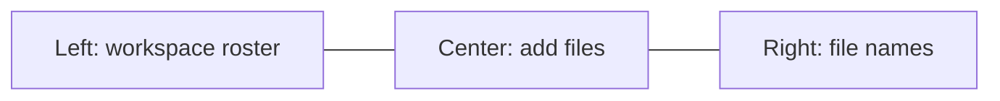
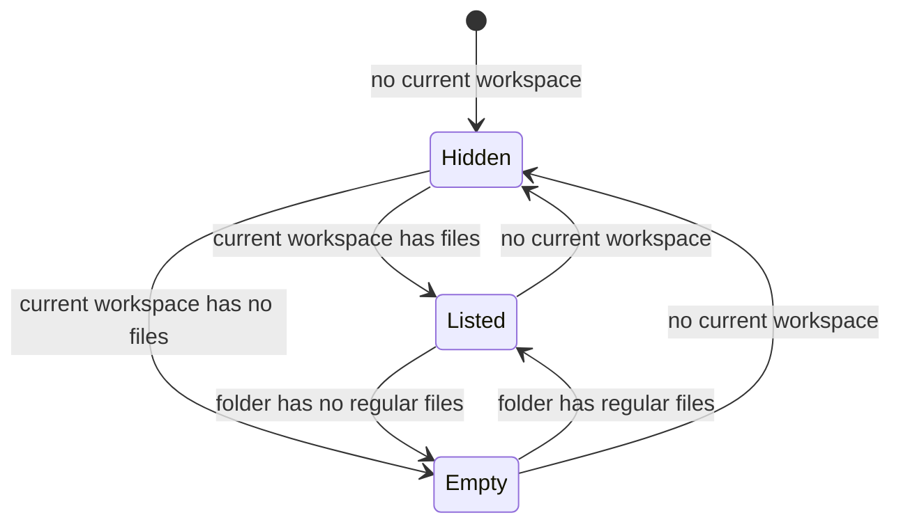
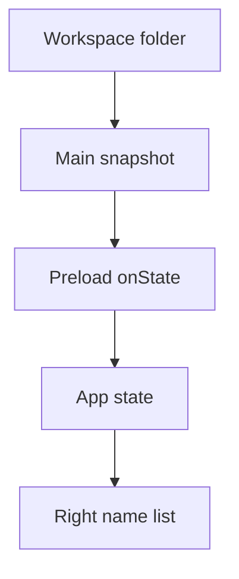
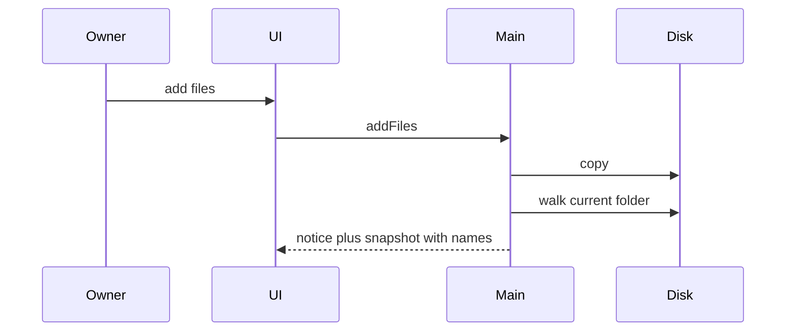

# Workspace Files Sidebar - Plan

## Goal Capsule

- **Objective:** Let the owner see the current workspace's file names in a right-hand rail, look-only, whenever a workspace is current — after add, switch, and reopen.
- **Product authority:** `AGENTS.md` and `ROADMAP.md` v1. This Product Contract wins on file-name visibility. `docs/plans/2026-08-13-1656-feat-cohort-desktop-workspace-loop-plan.md` remains authority for roster, add-files, and box, except the no-name-list rule this contract reopens.
- **Execution profile:** Test-first for the folder walk. Smoke the three-column window after add, switch, relaunch, and empty/no-current states.
- **Stop conditions:** None.
- **Tail ownership:** The implementer owns `pnpm test`, `pnpm run typecheck`, and a local `pnpm dev` smoke of F1–F5.
- **Open blockers:** None.

---

## Product Contract

### Summary

A right-hand list of file names for the current workspace.
It stays visible whenever a workspace is current, including after add, switch, and reopen.
Names are look-only.

### Problem Frame

The first workspace loop lets the owner add files and reports a short success.
It does not show names.
After a drop or pick, the owner cannot tell what landed, and reopen has the same gap.
There is no in-app way to inspect the current folder.

### Key Decisions

- **Standing inventory.** Show current names whenever a workspace is current, not only after an add. (session-settled: user-approved — chosen over add-receipt or just-added marks: names must survive reopen) Governs R4, R9, R10, R11.
- **Right sidebar.** File names sit on the right. (session-settled: user-directed — chosen over second left rail, stacked left rail, or files inside the workspace pane: roster stays left) Governs R1, R2, R3.
- **Look-only names.** The list is an inventory, not a file manager. (session-settled: user-directed — chosen over open, edit, or delete: names for now) Governs R8.
- **Every regular file, no tree.** Nested files use a relative path. (session-settled: user-approved — chosen over top-level-only or a folder tree: cover what is in the folder) Governs R4, R5, R6, R7.
- **Hide the rail when nothing is current.** An empty current workspace keeps the rail with no names. (session-settled: user-approved — chosen over a permanent empty rail: no current workspace means no files column) Governs R12, R13.
- **Reopen the no-name-list rule.** Keep the short add success. This contract adds the standing name list. Governs R9.

<!-- ce-section: work-relationships -->
### How This Work Fits Together

This plan owns the look-only file-name inventory on the right. The breakdown below is the current understanding, not a committed roadmap.

- First workspace loop (`docs/plans/2026-08-13-1656-feat-cohort-desktop-workspace-loop-plan.md`)
  - Enables this plan
  - Shares the left roster and the add-files center pane
- Captain conversation
  - Depends on the first workspace loop
  - Can proceed independently of this inventory
- File history
  - Still to decide as later product work per `ROADMAP.md`
  - Outside this plan

### Actors

- A1. Owner — the only user. Adds files, switches workspaces, and reads the name list.

### Requirements

**Placement**

- R1. When a workspace is current, a right-hand rail lists that workspace's files.
- R2. The left rail remains the workspace roster.
- R3. Add files stays in the center pane.

**Inventory**

- R4. The list includes every regular file in the current workspace folder.
- R5. A file at the folder root is shown by its file name.
- R6. A nested file is shown by its path relative to the workspace folder.
- R7. The list does not present a folder tree.
- R8. Names are look-only. Choosing a name does not open, edit, or delete the file.

**Lifecycle**

- R9. After a successful add, the list matches the current workspace folder. The short add success remains.
- R10. Switching the current workspace replaces the list with that workspace's files.
- R11. Quit and relaunch shows the restored current workspace's files without adding again.
- R12. When no workspace is current, the right rail is hidden.
- R13. When the current workspace has no regular files, the right rail stays and shows no names.

### Key Flows

- F1. See names after add
  - **Trigger:** Owner adds files while a workspace is current.
  - **Actors:** A1
  - **Steps:** Files land in the current folder. Short success still appears. The right rail lists names per R4–R6.
  - **Covered by:** R1, R4, R9
- F2. Switch workspace
  - **Trigger:** Owner selects another workspace in the left roster.
  - **Actors:** A1
  - **Steps:** The right rail lists the newly current folder. The previous workspace's names are gone.
  - **Covered by:** R2, R10
- F3. Reopen
  - **Trigger:** Owner quits and launches again with a current workspace that already has files.
  - **Actors:** A1
  - **Steps:** The right rail lists those files. The owner does not add them again.
  - **Covered by:** R11
- F4. No current workspace
  - **Trigger:** Owner is on first launch with an empty roster, or otherwise has no current workspace.
  - **Actors:** A1
  - **Steps:** The right rail is not shown.
  - **Covered by:** R12
- F5. Empty current workspace
  - **Trigger:** Owner selects or creates a workspace whose folder has no regular files.
  - **Actors:** A1
  - **Steps:** The right rail stays visible and shows no names.
  - **Covered by:** R13

### Acceptance Examples

- AE1. Names after add
  - **Covers R4, R5, R9.**
  - **Given:** Workspace Alpha is current and empty.
  - **When:** The owner adds `notes.md` and `shot.png`.
  - **Then:** The right rail shows `notes.md` and `shot.png`. A short success still appears.
- AE2. Nested path
  - **Covers R6, R7.**
  - **Given:** Alpha is current and contains `drafts/idea.md`.
  - **When:** The owner views the right rail.
  - **Then:** The rail shows `drafts/idea.md` and does not show a folder tree.
- AE3. Switch clears the previous list
  - **Covers R10.**
  - **Given:** Alpha is current and lists `notes.md`. Beta has `other.txt` only.
  - **When:** The owner selects Beta.
  - **Then:** The right rail shows `other.txt` and does not show `notes.md`.
- AE4. Reopen keeps names
  - **Covers R11.**
  - **Given:** Alpha is current and contains `notes.md`. The owner quits.
  - **When:** The owner launches again.
  - **Then:** The right rail shows `notes.md`.
- AE5. Hidden with no current workspace
  - **Covers R12.**
  - **Given:** The roster is empty.
  - **When:** The owner views the window.
  - **Then:** There is no right files rail.
- AE6. Empty workspace keeps the rail
  - **Covers R13.**
  - **Given:** Alpha is current and has no regular files.
  - **When:** The owner views the window.
  - **Then:** The right rail is visible and shows no names.
- AE7. Names do not open files
  - **Covers R8.**
  - **Given:** The right rail lists `notes.md`.
  - **When:** The owner chooses that name.
  - **Then:** The file does not open, edit, or delete.

### Scope Boundaries

**Deferred for later**

- Open, edit, or delete from the list
- Just-added highlights
- A folder tree
- File history (`ROADMAP.md` Later)
- Live refresh when files appear without an add, switch, or relaunch

**Outside this slice**

- A file manager or folder picker as the primary loop
- Captain chat, specialists, and custom tools
- Seeing or listing files from another workspace

**Deferred to Follow-Up Work**

- Wider default window if two 244px rails crowd the 960px shell

### Dependencies / Assumptions

- The first workspace loop is already in the app: roster, current workspace, add-files, and a per-workspace folder.
- The workspace folder on disk is the source of the names shown.
- Add-files still copies regular files only. This list may also show files created some other way in that folder.
- The owner had no in-app way to see names before this slice.

### Sources / Research

- `docs/plans/2026-08-13-1656-feat-cohort-desktop-workspace-loop-plan.md` — first loop; short success and no name list
- `src/renderer/src/components/workspace-sidebar.tsx` — left rail is the workspace roster
- `src/renderer/src/components/workspace-main.tsx` — add-files center pane; no file inventory
- `src/main/ipc.ts` — `snapshot()` and `sendState()`; `addFiles` does not push state today
- `src/shared/workspace.ts` — `AppStateDto` has no file list
- `src/main/files.ts` — flat copy only; listing must walk
- `ROADMAP.md` — file history is Later, not v1

---

## Planning Contract

Product Contract preservation: restructured, no scope change: sort-order outstanding question resolved as KTD4; R1–R13 and A/F/AE IDs unchanged.

### Key Technical Decisions

- KTD1. **Names ride on workspace state.** Extend `AppStateDto` with a file-name list. Omit it when no workspace is current. Use an empty list when a workspace is current and has no regular files. Populate it in `snapshot()`. (session-settled: user-approved — chosen over a separate list fetch: add, switch, and relaunch refresh the same way) Cites R1, R10, R11, R12, R13.
- KTD2. **Push state after add.** After `cohort:addFiles` copies, call `sendState()` so the rail matches the folder. Keep `formatAddNotice` for the short success. (session-settled: user-approved — chosen over renderer re-list only: add does not push state today) Cites R9.
- KTD3. **Main walks the folder.** List only regular files under `workspaceDir`. Use `lstat` and skip symlinks. Include dotfiles that are regular files. Nested files use a relative path with `/`. Do not emit folder rows. Stay inside the confined workspace directory. Cites R4, R5, R6, R7.
- KTD4. **Sort by relative path.** Order names with a locale-aware compare on the relative path. Cites R4.
- KTD5. **Broken folder keeps an empty rail.** If `folderError` is set or the walk fails, keep the rail when a workspace is current and show no names. Do not add a new error surface. (session-settled: user-approved — chosen over hiding the rail or a new rail error: reuse the center folder error) Cites R12, R13.
- KTD6. **Non-interactive name rows.** Render names as plain list text. Do not add file-open IPC or click handlers. Cites R8.

### High-Level Technical Design

Main walks the current folder and publishes names on the existing snapshot. The renderer only displays them. After add, main pushes the same snapshot it already returns on create and switch.

Renderer never reads disk. Names are relative display strings, not host paths.

### Sequencing

U1 walk, then U2 snapshot and add push, then U3 right rail.

### System-Wide Impact

- **IPC trust boundary:** Main derives paths and walks disk. The renderer receives relative names only. Do not add a list IPC that takes a host path.
- **Disk is the file source of truth:** No SQLite file table. Roster stays uuid, name, and current.
- **Add notice stays separate:** Inventory is state. Short success stays renderer-local notice.

### Risks

- `cohort:addFiles` does not call `sendState()` today. F1 fails unless U2 lands.
- A naive recursive walk that follows symlinks can leave the workspace root. Mitigate with KTD3.
- Vitest covers `src/main` only. AE5–AE7 need a `dev` smoke.
- Two 244px rails in a 960px window crowd the center pane. Accepted for this slice.

### Assumptions

- Nested AE2 fixtures are seeded on disk. In-app add still copies to the folder root only.
- Partial add success still pushes state so copied names appear.

---

## Implementation Units

### U1. List workspace files

- **Goal:** Main can return sorted relative names for regular files in a workspace folder.
- **Requirements:** R4, R5, R6, R7. KTD3, KTD4.
- **Dependencies:** none
- **Files:** `src/main/files.ts`, `src/main/files.test.ts`
- **Approach:**
  1. Add a list helper next to copy in `files.ts`.
  2. Resolve the folder with `workspaceDir`.
  3. Walk with `lstat` only. Skip symlinks and non-files. Do not emit directories.
  4. Return relative paths. Sort per KTD4.
  5. Empty, missing, or unreadable folder returns an empty list. Do not throw into IPC.
- **Execution note:** Implement the walk test-first.
- **Patterns to follow:** `copyFilesIntoWorkspace` regular-file and symlink guards. `files.test.ts` temp-home cleanup. `workspaceDir` confinement.
- **Test scenarios:**
  - Happy path: a root file returns its file name. Covers AE1 name shape / R5.
  - Happy path: `drafts/idea.md` returns `drafts/idea.md`. Covers AE2.
  - Happy path: empty folder returns `[]`.
  - Edge: a symlink file or directory is omitted.
  - Edge: a suffixed copy name such as `a (1).txt` appears as on disk.
  - Edge: names sort by relative path.
  - Error: missing or unreadable folder returns `[]`.
  - Integration: listing uuid B does not include files from uuid A.
- **Verification:** `pnpm test` covers the walk cases. No renderer import of `fs`.

### U2. Publish names on workspace state

- **Goal:** Create, switch, relaunch, and add all deliver the current folder's names on `AppStateDto`.
- **Requirements:** R9, R10, R11, R12, R13. KTD1, KTD2, KTD5.
- **Dependencies:** U1
- **Files:** `src/shared/workspace.ts`, `src/main/ipc.ts`, `src/preload/index.ts`, `src/preload/index.d.ts`
- **Approach:**
  1. Add the optional file-name list to `AppStateDto`.
  2. In `snapshot()`, omit the list when no workspace is current. When current, set it from U1. If `folderError` is set or the walk fails, use `[]`.
  3. After `addFiles` returns the copy report, call `sendState()`.
  4. Do not add a new preload method unless snapshot extension is impossible.
- **Patterns to follow:** Existing `snapshot()` / `sendState()` / `onState` path. First-loop KTD2 closed bridge.
- **Test scenarios:**
  - Happy path: after a successful copy, a following snapshot lists the new names. Covers AE1 / F1.
  - Happy path: snapshot for workspace B lists only B. Covers AE3 / F2.
  - Edge: no current workspace omits the file list. Covers AE5 data side.
  - Edge: current empty folder yields `[]`. Covers AE6 data side.
  - Edge: partial copy still publishes the files that landed.
  - Error: `folderError` set yields `[]` and keeps the existing folder error field.
- **Verification:** Tests or a thin snapshot helper prove add/switch/empty/omitted shapes. Preload allowlist gains no host-path API.

### U3. Right files rail

- **Goal:** The window shows a look-only right rail of names when a workspace is current.
- **Requirements:** R1, R2, R3, R8, R12, R13. KTD6.
- **Dependencies:** U2
- **Files:** `src/renderer/src/App.tsx`, `src/renderer/src/components/workspace-files-sidebar.tsx`
- **Approach:**
  1. Add a right-rail component that mirrors the left rail chrome and uses non-interactive name rows.
  2. Mount it as the third flex child in `App.tsx`: roster, main, files.
  3. Render the rail only when a workspace is current. Empty list still shows the rail.
  4. Do not change add-files or the left roster beyond layout.
- **Execution note:** Prefer `pnpm dev` smoke over new renderer tests. Vitest is main-only.
- **Patterns to follow:** `workspace-sidebar.tsx` width, hairline, surface, section label. `currentName` current-workspace check in `workspace-main.tsx`.
- **Test scenarios:**
  - Happy path: current workspace with files shows those names on the right. Covers AE1 UI / F1.
  - Happy path: switch replaces the names. Covers AE3 / F2.
  - Happy path: relaunch shows stored names. Covers AE4 / F3.
  - Edge: no current workspace hides the rail. Covers AE5 / F4.
  - Edge: empty current workspace shows the rail with no names. Covers AE6 / F5.
  - Edge: choosing a name does not open or delete it. Covers AE7.
- **Verification:** `pnpm dev` smoke of F1–F5 and AE5–AE7. Left roster and center add-files still work. `pnpm run typecheck` passes.

---

## Verification Contract

- `pnpm test` — U1 walk cases and U2 snapshot/add-refresh cases.
- `pnpm run typecheck` — shared DTO and renderer compile.
- `pnpm dev` — F1–F5 and AE5–AE7 in the window.
- Do not add renderer test tooling in this slice.

---

## Definition of Done

- R1–R13 hold for F1–F5 and AE1–AE7.
- Product Contract IDs are unchanged and cited from units.
- Abandoned listing experiments are not left in the diff.
- `pnpm test` and `pnpm run typecheck` pass.
- A local `dev` smoke showed names after add, after switch, on relaunch, hidden with no current workspace, and empty with an empty current workspace.
