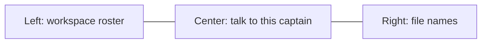
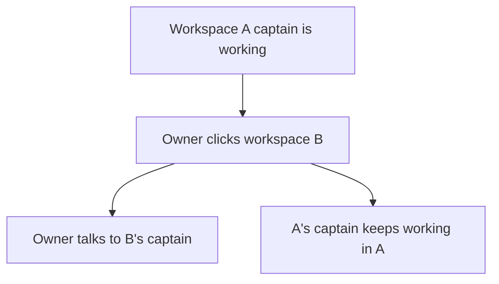
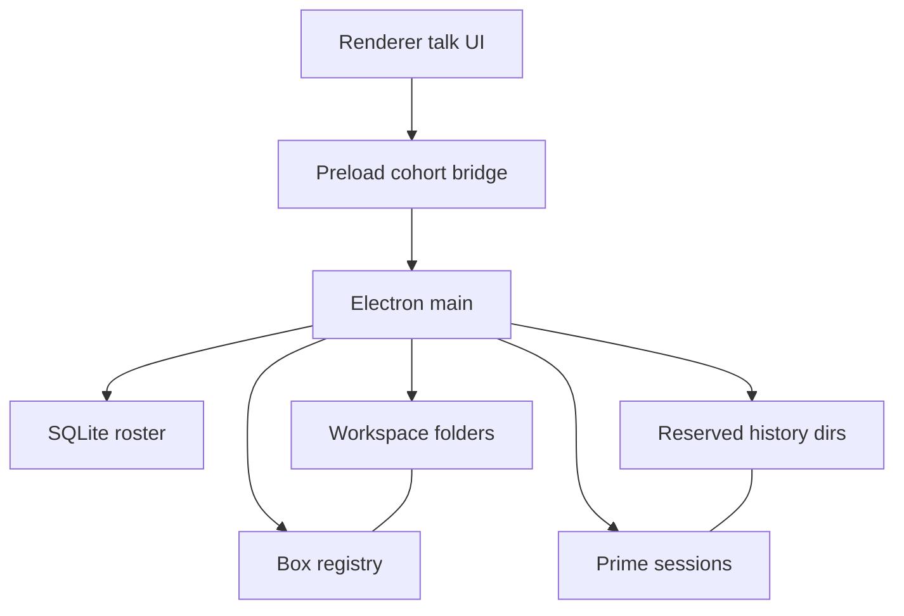
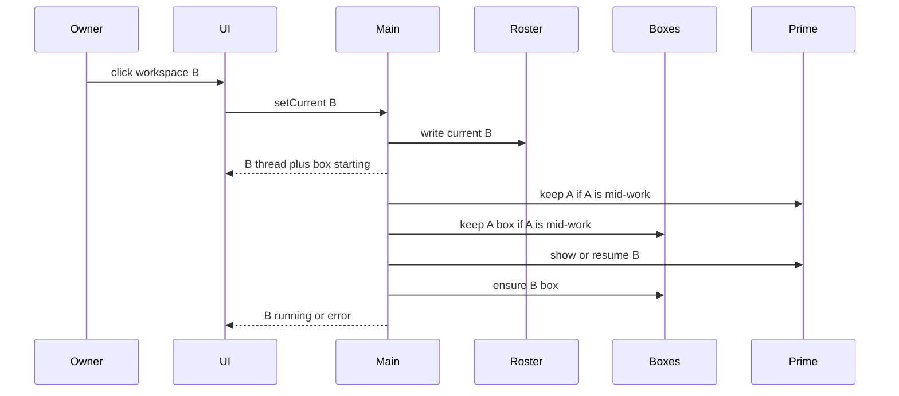
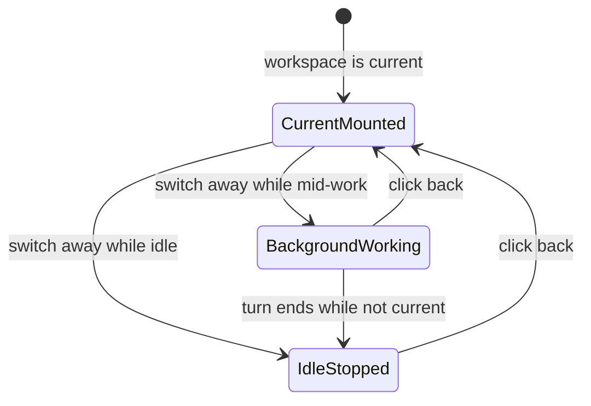

# Prime Workspace Captain - Plan

## Goal Capsule

- **Objective:** Let the owner talk to the current workspace's captain in the app, with history that stays with that workspace, while that captain stays isolated and can keep working after a switch.
- **Product authority:** `AGENTS.md` and `ROADMAP.md` v1. This Product Contract wins on captain conversation, per-workspace history, keeping a working captain's sandbox live after switch, and hiding the reserved captain history directory from the name list. `docs/plans/2026-08-13-1656-feat-cohort-desktop-workspace-loop-plan.md` remains authority for roster, add-files, and UUID folders, except the one-live-box-while-current rule this contract reopens when a captain is still working. `docs/plans/2026-08-14-1026-feat-workspace-files-sidebar-plan.md` remains authority for the look-only name list except that reserved-directory exclusion.
- **Execution profile:** Spike-first for the Prime embed in Electron main. Test-first for multi-live sandboxes, session isolation, and history-dir exclusion. Smoke talk, switch mid-work, come-back, and reopen.
- **Stop conditions:** If the Prime SDK cannot run in Electron main after the U1 spike, stop and report a blocker. Do not shell out to the Prime CLI as the kernel.
- **Tail ownership:** The implementer owns native-module rebuild with the existing Electron ABI, `pnpm test`, `pnpm run typecheck`, and a local `pnpm dev` smoke of F1–F4.
- **Open blockers:** None.

---

## Product Contract

### Summary

The owner talks to the current workspace's captain.
That conversation and its history belong to that workspace.
Clicking another workspace means they meet that captain; the one they left keeps working in its own sandbox and can keep changing files there.

### Problem Frame

The desktop app already has a roster, a current workspace, add-files, a look-only name list, and one sandbox for whichever workspace is current.
There is no captain to talk to, and no chat that stays with a workspace.
The first workspace loop deferred conversation on purpose: prove create, reopen, files, and a live box before embedding the agent runtime.
Until talking exists, the owner cannot run a workspace through its captain, and a host-wide agent would break the isolation `AGENTS.md` already requires.

### Key Decisions

- **Meet this workspace's captain.** Talking is how the owner runs the current workspace. (session-settled: user-directed — chosen over a chat sidecar or a fresh captain each visit: talking is the main act) Governs R1, R11.
- **History stays with the workspace.** (session-settled: user-directed — chosen over pin-only or "switch is enough": a conversation must survive reopen) Governs R6, R14.
- **Clicking away does not stop the other captain.** (session-settled: user-directed — chosen over pause, warn, or block: isolation is why A can keep going) Governs R7, R8.
- **Several workspaces may stay live.** (session-settled: user-approved — chosen over only the workspace in view, or background replies without file changes: otherwise background file work is fake) Governs R8, R9.
- **One captain identity per workspace in this slice.** Isolation is the whole rule: no shared runtime across workspaces, no second agent identity here. Governs R2, R3, R4, R5.
- **Reopen one-live-box while a captain is working.** Today's sandbox leaves with the current workspace. This contract keeps that captain's sandbox up so it can keep changing files. Governs R8, R9.
- **Coming back shows the missed work.** (session-settled: user-approved — chosen over leaving background work invisible: thread and files) Governs R10.
- **Add files stays possible.** (session-settled: user-approved — chosen over replacing add-files entirely: not the main act) Governs R11.

<!-- ce-section: work-relationships -->

### How This Work Fits Together

This plan owns talking to the current workspace's captain, with isolation and background work after switch. The breakdown below is the current understanding, not a committed roadmap.

- First workspace loop (`docs/plans/2026-08-13-1656-feat-cohort-desktop-workspace-loop-plan.md`)
  - Enables this plan
  - Shares the left roster, current workspace, add-files, and per-workspace folder
- Workspace files sidebar (`docs/plans/2026-08-14-1026-feat-workspace-files-sidebar-plan.md`)
  - Shares the right-hand look-only name list
  - Can proceed independently of this plan
- Specialists and workspace-local tools
  - Depends on captain conversation
  - Still to decide as later product work
  - Outside this plan
- Cross-workspace captain view (`ROADMAP.md` v2)
  - Outside this plan
- Shared knowledge base, remote workspaces, other users
  - Outside v1 identity per `AGENTS.md`

### Actors

- A1. Owner — the only user. Talks to the current captain, switches workspaces, and adds files.
- A2. Workspace captain — one Prime Agent identity per workspace. Sees and changes only that workspace. May keep working after the owner clicks away.
- A3. Workspace sandbox — the boxed environment for a workspace's files. More than one may stay live when captains are still working.

### Requirements

**Conversation**

- R1. When a workspace is current, the owner talks to that workspace's captain in the app. Talking is the main act of a current workspace.
- R2. Each workspace has exactly one captain in this slice. That captain belongs to that workspace only.
- R3. The runtime is Prime Agent, embedded in the app, one session per workspace, per `AGENTS.md`. This slice does not add specialists.

**Isolation**

- R4. A captain can see only its own workspace's prompts, files, chat, and other state.
- R5. A captain can change files only in its own workspace.
- R6. Chat history stays with the workspace that produced it.

**Switch and background work**

- R7. Clicking another workspace means the owner talks to that workspace's captain. They do not continue the previous workspace's thread.
- R8. If the captain just left was still working, it keeps working in that workspace. Its sandbox stays up so it can keep changing files there.
- R9. More than one workspace may stay live at once. Each captain still only sees its own workspace.
- R10. Returning to a workspace shows what that captain did while the owner was away: the thread and the files.

**Files**

- R11. Add files remains available on the current workspace. It is not the main act.
- R12. The look-only name list still shows the current workspace's files, including files that captain wrote, per `docs/plans/2026-08-14-1026-feat-workspace-files-sidebar-plan.md`.

**Empty and reopen**

- R13. With no current workspace, there is no captain to talk to. The owner creates or selects a workspace first.
- R14. After quit and reopen, each workspace still has its own captain history.

### Key Flows

- F1. Talk to the current captain
  - **Trigger:** A workspace is current and the owner sends a message.
  - **Actors:** A1, A2, A3
  - **Steps:** The owner talks in that workspace. The captain replies in that thread and may change files only there.
  - **Outcome:** The thread and any new files belong to that workspace.
  - **Covered by:** R1, R2, R4, R5, R6
- F2. Meet the other captain
  - **Trigger:** The owner clicks another workspace in the roster while a captain may still be working.
  - **Actors:** A1, A2, A3
  - **Steps:** The owner talks to the newly current captain. The previous captain keeps working if it was mid-work. Its sandbox stays up.
  - **Outcome:** The owner is in the new workspace's thread, not the previous one.
  - **Covered by:** R7, R8, R9
- F3. Return to a working workspace
  - **Trigger:** The owner clicks back to a workspace whose captain worked in the background.
  - **Actors:** A1, A2
  - **Steps:** The owner sees that workspace's thread, including turns that happened while they were away, and the name list reflects files written meanwhile.
  - **Outcome:** Background work is visible in that workspace.
  - **Covered by:** R10, R12
- F4. Reopen
  - **Trigger:** The owner quits and opens the app again with the same workspaces.
  - **Actors:** A1, A2
  - **Steps:** Selecting a workspace shows that workspace's captain history, not another workspace's.
  - **Outcome:** History survived with the workspace.
  - **Covered by:** R6, R14

### Acceptance Examples

- AE1. Switch mid-work
  - **Covers R7, R8, R9.**
  - **Given:** Workspace A is current. Its captain is still changing files.
  - **When:** The owner clicks workspace B.
  - **Then:** The owner talks to B's captain. A's captain keeps working in A. A's files continue to change there.
- AE2. No leftover thread
  - **Covers R7.**
  - **Given:** The owner was in the middle of A's thread.
  - **When:** They click workspace B.
  - **Then:** They see B's thread, not A's next reply.
- AE3. Come back
  - **Covers R10, R12.**
  - **Given:** A's captain wrote a file and sent a reply while the owner was in B.
  - **When:** The owner clicks A again.
  - **Then:** A's thread shows that reply and the name list includes the new file.
- AE4. Isolation
  - **Covers R4, R5.**
  - **Given:** A and B both have files. A's captain is working.
  - **When:** A's captain reads or changes files.
  - **Then:** It only sees and changes A's files, never B's.
- AE5. Add files still works
  - **Covers R11.**
  - **Given:** A workspace is current and the owner is talking to its captain.
  - **When:** The owner adds a file the same way they do today.
  - **Then:** The file lands in that workspace.
- AE6. No current workspace
  - **Covers R13.**
  - **Given:** No workspace is current.
  - **When:** The owner looks at the main pane.
  - **Then:** There is no captain to talk to. They are told to create or select a workspace.
- AE7. Reopen
  - **Covers R6, R14.**
  - **Given:** The owner had a thread in workspace A, then quit.
  - **When:** They reopen the app and select A.
  - **Then:** A's history is there. It is not B's history.
- AE8. History stays off the name list
  - **Covers R6, R12.**
  - **Given:** Workspace A has captain history on disk.
  - **When:** The owner looks at the file-name list.
  - **Then:** Owner files and captain-written files show. The reserved history directory does not.
- AE9. Idle switch drops the sandbox
  - **Covers R8.**
  - **Given:** Workspace A's captain is idle. A is not current.
  - **When:** The owner is in workspace B.
  - **Then:** A's thread is kept. A's sandbox is not kept live.
- AE10. Talk while sandbox is starting
  - **Covers R1, R5.**
  - **Given:** A workspace is current and its sandbox is still starting.
  - **When:** The owner sends a message.
  - **Then:** The message is accepted into that workspace's thread. File and command work waits until that sandbox is running.

### Success Criteria

- After a switch, the owner is clearly with the newly current captain, not still in the previous thread.
- After coming back, the owner can point to something that captain did while they were away, in the thread or the files.

### Scope Boundaries

**Deferred for later**

- Specialists and custom agents
- Agents creating tools for themselves
- Runtime customization UI
- A captain that can see or summarize other workspaces
- File history and search over chat history

**Outside this product's identity**

- Other users, accounts, or sharing
- Remote or cloud workspaces
- Shared knowledge base
- A host-wide Prime daemon
- Shelling out to the Prime CLI as the kernel
- Deep Agents as the runtime
- Inventing a first named mission

**Deferred to Follow-Up Work**

- Renderer or browser tests for the chat pane
- Packaged installer changes beyond the existing native rebuild

### Dependencies / Assumptions

- The first workspace loop is already in the app: roster, current workspace, add-files, per-workspace folder, and a sandbox for the current workspace.
- The look-only name list is already in the app on the right.
- v1 is for the owner. There is no other user.
- Isolation skipped a first-choice prompt; the synthesis confirmation kept it as the whole rule.
- Current code runs one sandbox and remounts on switch. This plan reopens that for captains that are still working.
- There is no captain, chat, or Prime integration in the app today.
- Owner model credentials may be shared across workspaces. Prompts, sessions, and files may not.

### Outstanding Questions

**Deferred to implementation**

- Exact Prime SDK version and Electron native rebuild flags after the U1 spike.
- How streaming events map onto the visible thread.
- Whether a current workspace that is idle keeps its sandbox (today it does; keep that unless the spike shows a cheaper idle policy).

### Sources / Research

- `AGENTS.md` — Prime Agent embedded, one session per workspace, captain isolation, no host-wide daemon.
- `ROADMAP.md` — talk to the current workspace's captain; specialists and cross-workspace view are later.
- `docs/plans/2026-08-13-1656-feat-cohort-desktop-workspace-loop-plan.md` — captain, chat, and Prime deferred; box runs while a workspace is current and switching remounts.
- `docs/plans/2026-08-14-1026-feat-workspace-files-sidebar-plan.md` — look-only names on the right; every regular file including nested dotfiles.
- `src/main/box.ts` — one running box; `setCurrent` stops it and remounts.
- `src/main/ipc.ts` — `cohort:list`, `create`, `setCurrent`, `addFiles`; `sendState` on box change and after add.
- `src/main/files.ts` — `listWorkspaceFiles` walks every regular file; no reserved-dir skip.
- `package.json` — no Prime Agent dependency yet.
- [Prime Agent SDK](https://github.com/PrimeIntellect-ai/prime-agent/blob/main/packages/coding-agent/docs/sdk.md) — `createAgentSession`, `SessionManager`, per-cwd persistence, custom-cwd tool factories; SDK preferred over RPC/CLI in Node.

---

## Planning Contract

Product Contract preservation: restructured, no scope change: AE8–AE10 record planning resolutions of deferred questions; R1–R14 unchanged.

### Key Technical Decisions

- KTD1. **Embed Prime in main via the SDK.** Use `@earendil-works/pi-coding-agent` `createAgentSession` in the Electron main process. Do not spawn `prime-agent` CLI or RPC as the kernel. (session-settled: user-approved — chosen over CLI/RPC kernel: AGENTS.md forbids shelling out) Cites R3.
- KTD2. **One session per workspace uuid.** Pin `cwd`, `agentDir`, and `SessionManager` to that workspace. Do not use the default host-wide `~/.prime/agent`. Cites R2, R4, R6.
- KTD3. **Shared owner auth, isolated sessions.** Model credentials may live in owner-level auth storage. Prompts, history, and tools must not. Cites R4.
- KTD4. **Multi-live sandbox registry.** Replace the single `BoxManager` slot. The current workspace stays mounted. A non-current workspace keeps its sandbox only while its captain is mid-work. Idle non-current drops the sandbox and keeps the thread. (session-settled: user-approved — chosen over keeping every idle sandbox: only mid-work needs the box) Cites R8, R9.
- KTD5. **Commands run in that workspace's box.** Do not give the captain unconstrained host bash. File read/write may use the host workspace tree, which the box mounts as `/workspace`. (session-settled: user-approved — chosen over host shell: otherwise isolation is fake) Cites R4, R5.
- KTD6. **History files in a reserved workspace directory.** Persist Prime sessions under that workspace folder. Exclude that directory from `listWorkspaceFiles`. (session-settled: user-approved — chosen over showing history in the name list, or storing history only in SQLite: history stays with the folder, names stay owner files) Cites R6, R12, R14.
- KTD7. **Closed captain IPC.** Renderer sends uuid plus message text. Main owns Prime, paths, and boxes. Push thread and file-name updates with `sendState` after captain events, including background file writes. Cites R1, R7, R10, R12.
- KTD8. **Add files is a header control.** The center pane is the current captain thread. (session-settled: user-approved — chosen over keeping add-files as the center hero: talking is the main act) Cites R1, R11.
- KTD9. **Stream the current thread; persist the rest.** While a workspace is current, show in-flight tokens and tool activity. Background captains persist through the session manager. Coming back loads the saved thread. Cites R10.
- KTD10. **Accept talk before the box is ready.** Queue or hold tool work until that workspace's sandbox is running. Do not block sending. Cites R1, R5.
- KTD11. **No confirm step for in-workspace file changes.** Talking is how the owner runs the workspace. The captain may change files in that workspace without a per-edit approval prompt. Adding files from the header stays owner-initiated. Cites R1, R5.

### High-Level Technical Design

Renderer stays untrusted. Main owns Prime sessions, boxes, and history files. SQLite still owns the roster and current pointer. Host folders stay the file source of truth.

Switch commits current in SQLite first. The UI shows the newly current thread. A working captain on the previous uuid keeps its Prime session and box.

Sandbox liveness is not the same as current.

### Sequencing

U1 Prime spike can run beside U2 multi-live boxes. U3 isolated captain host needs both. U4 IPC, then U5 talk UI. U6 quit, reopen, and background file refresh close the loop.

### System-Wide Impact

- **IPC trust boundary:** Renderer still sends UUIDs and text only. Main derives paths and talks to Prime.
- **Native ABI:** Prime joins `better-sqlite3` and Boxlite on the Electron rebuild. U1 fails closed if the SDK will not load in main.
- **Box lifecycle:** `src/main/box.ts` one-slot remount and `box.test.ts` stop-on-switch are replaced, not layered.
- **State push:** Background file writes must call `sendState`. There is no folder watcher today.
- **Quit:** `before-quit` must stop every live session and box, not one.
- **Name list:** Reserved history directory is excluded; captain-written owner files still appear.
- **Shared workspace:** Owner and captain use the same workspace folder. The captain's tools must not see another uuid's folder.
- **Human-only:** Picker/drop add-files stays owner-initiated. There is no per-edit approval for captain writes in this slice per KTD11.

### Risks

- Prime SDK may not load in Electron main. U1 spikes first. Stop per the Goal Capsule. Do not fall back to CLI.
- Default Prime `agentDir` and host bash would leak across workspaces. Mitigate with KTD2 and KTD5.
- Rapid switch can race box and session start. Reuse a per-uuid generation queue, not one global remount that kills background work.
- History files in the workspace folder would show in the name list without KTD6.
- App quit that only stops the current box leaves orphan background boxes.
- Vitest covers main only. Chat UI acceptance is a `pnpm dev` smoke unless a later follow-up adds renderer tests.

### Assumptions

- The confirmed plan-time scope stands: commands in the sandbox, history off the name list, add-files as a header control, idle non-current sandboxes dropped.
- Owner auth may be shared. That is not a host-wide Prime daemon.
- No `docs/solutions/` learnings exist for this slice.

---

## Implementation Units

### U1. Prime embed spike

- **Goal:** Electron main can create one in-process Prime session and receive a reply without the CLI.
- **Requirements:** R3
- **Dependencies:** none
- **Files:** `package.json`, `src/main/captain.ts`, `src/main/captain.test.ts`
- **Approach:**
  1. Add the Prime SDK per KTD1. Lazy-import like `src/main/live-box.ts`.
  2. Prove `createAgentSession` plus `session.prompt` in main with an injectable session factory.
  3. Do not wire UI, multi-workspace, or host bash in this unit.
- **Execution note:** Spike first. Stop if the SDK cannot run in Electron main.
- **Patterns to follow:** `src/main/live-box.ts` lazy native import. `src/main/box.test.ts` injectable starter.
- **Test scenarios:**
  - Happy path: a fake session factory returns a reply from `prompt`.
  - Error: a failed SDK import surfaces a typed error and does not spawn a CLI.
  - Edge: tests never call a live network model unless explicitly gated.
- **Verification:** Unit tests pass with a fake session. A local spike note records whether live Electron main can load the SDK. No `prime-agent` child process.

### U2. Multi-live sandbox registry

- **Goal:** More than one workspace can keep a box while its captain is mid-work. Idle non-current boxes stop.
- **Requirements:** R8, R9
- **Dependencies:** none
- **Files:** `src/main/box.ts`, `src/main/box.test.ts`, `src/main/ipc.ts`, `src/shared/workspace.ts`, `src/main/app-state.ts`, `src/main/app-state.test.ts`
- **Approach:**
  1. Replace the single `running` slot with a uuid-keyed registry per KTD4.
  2. Current workspace always mounts. Non-current stays only while marked working.
  3. Keep guest path `/workspace` and `createLiveBoxStarter`.
  4. Snapshot can describe current box status without pretending background boxes do not exist.
  5. Rewrite stop-on-switch tests. They are no longer the happy path when the previous uuid is working.
- **Execution note:** Implement domain behavior test-first.
- **Patterns to follow:** `BoxManager` generation queue, but per uuid. Product Key Decision "Reopen one-live-box while a captain is working".
- **Test scenarios:**
  - Happy path: switch from A to B while A is working leaves A's box running. Covers AE1 box side.
  - Happy path: switch from idle A to B stops A's box and keeps B mounting. Covers AE9.
  - Edge: overlapping switches on the same uuid do not start two boxes.
  - Error: a start failure on B keeps A running if A was working, and surfaces B's error.
  - Error: `quit` stops every live box.
- **Verification:** `pnpm test` covers AE1/AE9 box behavior. `ipc` create/switch no longer always remounts by killing the previous uuid.

### U3. Isolated captain host

- **Goal:** Each workspace uuid has one Prime session, pinned to that folder and box, with history on disk.
- **Requirements:** R2, R4, R5, R6, R14
- **Dependencies:** U1, U2
- **Files:** `src/main/captain.ts`, `src/main/captain.test.ts`, `src/main/files.ts`, `src/main/files.test.ts`, `src/main/paths.ts`
- **Approach:**
  1. One session map keyed by uuid per KTD2.
  2. Persist with `SessionManager` under the reserved history directory per KTD6.
  3. Bind command tools to that uuid's box per KTD5. File tools stay inside `workspaceDir`.
  4. Skip the reserved directory in `listWorkspaceFiles`.
  5. Continue the saved session on reopen. Do not open B's files when prompting A.
- **Execution note:** Implement isolation behavior test-first.
- **Patterns to follow:** `assertSafeUuid` and `workspaceDir`. Product Key Decision "One captain identity per workspace".
- **Test scenarios:**
  - Happy path: two uuids keep separate session stores. Covers AE4 and AE7 host side.
  - Happy path: a captain write under the workspace tree is visible to `listWorkspaceFiles`. Covers AE3 files side.
  - Edge: reserved history paths are absent from the name list. Covers AE8.
  - Error: a prompt for an unknown or unsafe uuid is rejected before any session opens.
  - Error: command tools are not invoked with the Electron process cwd.
  - Error: session A cannot be constructed with B's `cwd`, `agentDir`, or file-tool root. Covers AE4.
- **Verification:** Tests prove two workspaces cannot share session files or file-tool roots. Name list hides the reserved directory.

### U4. Captain IPC and state push

- **Goal:** The renderer can send a message to the current workspace's captain and receive thread plus file-name updates without touching Prime.
- **Requirements:** R1, R7, R10, R12
- **Dependencies:** U3
- **Files:** `src/main/ipc.ts`, `src/shared/workspace.ts`, `src/preload/index.ts`, `src/preload/index.d.ts`, `src/main/app-state.ts`, `src/main/app-state.test.ts`
- **Approach:**
  1. Add `cohort:*` handlers for send and for reading the current thread. Renderer sends uuid and text only per KTD7.
  2. Put the current thread on the snapshot. Switching current changes which thread is in the snapshot.
  3. Subscribe to session events in main. Call `sendState` on message updates and after file tools so the name list moves.
  4. Accept send while that uuid's box is starting per KTD10.
- **Patterns to follow:** Existing `cohort:` allowlist and `sendState`. KTD2 from the workspace-loop plan (closed bridge).
- **Test scenarios:**
  - Happy path: send on current A returns A's thread, not B's. Covers AE2 IPC side.
  - Happy path: a background file event on A followed by setCurrent A includes the new name. Covers AE3.
  - Edge: send with no current workspace fails without opening a session. Covers AE6 IPC side.
  - Edge: send while box is starting is accepted. Covers AE10.
  - Error: renderer cannot pass a host path or session file path.
- **Verification:** Preload expose list includes the new methods and nothing else raw. Snapshot after switch shows only the new current thread.

### U5. Talk UI

- **Goal:** A current workspace's center pane is the captain thread. Add files stays available as a header control.
- **Requirements:** R1, R11, R13
- **Dependencies:** U4
- **Files:** `src/renderer/src/components/workspace-main.tsx`, `src/renderer/src/App.tsx`
- **Approach:**
  1. Replace the add-files hero with the current thread per KTD8.
  2. Keep drop/picker as a header or equivalent secondary control. Reuse existing add-files IPC.
  3. No current workspace keeps the create/select empty state per R13.
  4. Show in-flight text for the current uuid per KTD9. Do not paint A's stream while B is current.
- **Execution note:** This is mostly UI; prefer `pnpm dev` smoke over new renderer tests.
- **Patterns to follow:** Existing header, sandbox badge, shadcn controls, `DESIGN.md` tokens.
- **Test scenarios:**
  - Happy path: with a current workspace, the owner can type and see a reply in the center. Covers F1.
  - Happy path: add files from the header still copies into the current workspace. Covers AE5.
  - Happy path: clicking B shows B's thread. Covers AE2.
  - Edge: no current workspace shows no composer. Covers AE6.
- **Verification:** Local smoke of F1, AE2, AE5, AE6. Left roster and right name list stay in place.

### U6. Quit, reopen, and background refresh

- **Goal:** Background work survives a switch, history survives quit, and no boxes or sessions remain after quit.
- **Requirements:** R8, R10, R14
- **Dependencies:** U2, U3, U4, U5
- **Files:** `src/main/index.ts`, `src/main/ipc.ts`, `src/main/captain.ts`, `src/main/box.ts`
- **Approach:**
  1. `before-quit` stops every Prime session and every box.
  2. Relaunch does not auto-resume background work. Selecting a workspace loads that history per KTD2.
  3. Prove `sendState` after a background file write so come-back names are current even if the owner never re-adds files.
- **Patterns to follow:** Existing `registerIpc().quit`. Product flows F3 and F4.
- **Test scenarios:**
  - Happy path: quit stops all boxes, including a working non-current uuid.
  - Happy path: reopen and select A restores A's thread. Covers AE7.
  - Happy path: A writes a file while B is current; clicking A lists that file. Covers AE3.
  - Error: a failed stop on quit still attempts the remaining uuids and surfaces an error.
- **Verification:** `pnpm test` for quit-all and reopen load. `pnpm dev` smoke of AE1, AE3, AE7.

---

## Verification Contract

- `pnpm test` — U1–U4 and U6 main-process tests, including AE1/AE3/AE4/AE7/AE8/AE9 box and host cases.
- `pnpm run typecheck` — main and renderer.
- `pnpm dev` smoke — F1 talk, F2 switch mid-work, F3 come-back, F4 reopen, AE5 add files, AE6 empty.

---

## Definition of Done

- R1–R14 hold on a local Mac run of F1–F4.
- AE1–AE10 are covered by unit tests, smoke, or both as named in the units.
- No Prime CLI child process is the kernel.
- No host-wide Prime `agentDir` is used for workspace prompts or history.
- Quit leaves no live boxes or sessions.
- Abandoned spike code from a failed Prime load path is removed from the diff.
- Product Contract IDs R/A/F/AE are unchanged except the added AE8–AE10.
